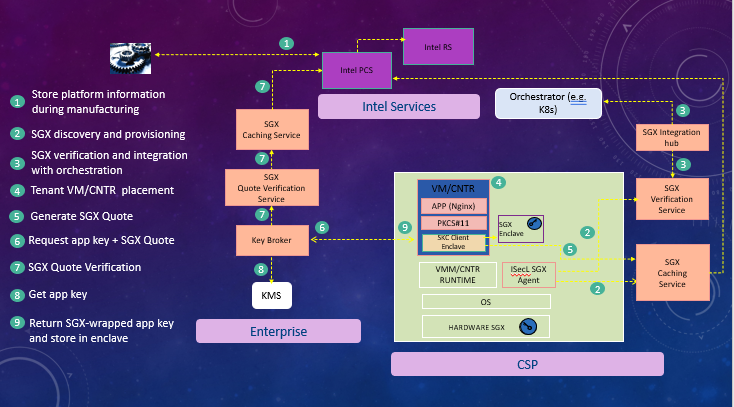

# Intel® Security Libraries - Datacenter Secure Key Caching

## Product Guide
### October 2020

### Revision 3.1

Notice: This document contains information on products in the design phase of development. The information here is subject to change without notice. Do not finalize a design with this information.

Intel technologies’ features and benefits depend on system configuration and may require enabled hardware, software, or service activation. Learn more at intel.com, or from the OEM or retailer.

No computer system can be absolutely secure. Intel does not assume any liability for lost or stolen data or systems or any damages resulting from such losses.

You may not use or facilitate the use of this document in connection with any infringement or other legal analysis concerning Intel products described herein. You agree to grant Intel a non-exclusive, royalty-free license to any patent claim thereafter drafted which includes subject matter disclosed herein.

No license (express or implied, by estoppel or otherwise) to any intellectual property rights is granted by this document.

The products described may contain design defects or errors known as errata which may cause the product to deviate from published
specifications. Current characterized errata are available on request.

This document contains information on products, services and/or processes in development. All information provided here is subject to
change without notice. Contact your Intel representative to obtain the latest Intel product specifications and roadmaps.

Intel disclaims all express and implied warranties, including without limitation, the implied warranties of merchantability, fitness for a particular purpose, and non-infringement, as well as any warranty arising from course of performance, course of dealing, or usage in trade.

Warning: Altering PC clock or memory frequency and/or voltage may (i) reduce system stability and use life of the system, memory and
processor; (ii) cause the processor and other system components to fail; (iii) cause reductions in system performance; (iv) cause additional heat or other damage; and (v) affect system data integrity. Intel assumes no responsibility that the memory, included if used with altered clock frequencies and/or voltages, will be fit for any particular purpose.
Check with memory manufacturer for warranty and additional details.

Tests document performance of components on a particular test, in specific systems. Differences in hardware, software, or configuration
will affect actual performance. Consult other sources of information to evaluate performance as you consider your purchase. For more complete information about performance and benchmark results, visit http://www.intel.com/performance.

Cost reduction scenarios described are intended as examples of how a given Intel- based product, in the specified circumstances and
configurations, may affect future costs and provide cost savings. Circumstances will vary. Intel does not guarantee any costs or cost
reduction.

Results have been estimated or simulated using internal Intel analysis or architecture simulation or modeling, and provided to you for
informational purposes. Any differences in your system hardware, software or configuration may affect your actual performance.

Intel does not control or audit third-party benchmark data or the web sites referenced in this document. You should visit the referenced web site and confirm whether referenced data are accurate.

Intel is a sponsor and member of the Benchmark XPRT Development Community, and was the major developer of the XPRT family of benchmarks. Principled Technologies is the publisher of the XPRT family of benchmarks. You should consult other information and performance tests to assist you in fully evaluating your contemplated purchases.

Copies of documents which have an order number and are referenced in this document may be obtained by calling 1-800-548-4725 or by visiting w[ww.intel.com/design/literature.htm.](http://www.intel.com/design/literature.htm)

Intel, the Intel logo, Intel TXT, and Xeon are trademarks of Intel Corporation in the U.S. and/or other countries.

\*Other names and brands may be claimed as the property of others.

Copyright © 2020, Intel Corporation. All Rights Reserved.

Revision History

[[_TOC_]]

# 1 Introduction 

## 1.1 Overview

 Secure Key Caching (SKC) is part of the Intel Security Libraries for datacenter (ISecL-DC). Intel Security Libraries for Datacenter is a collection of software applications and development libraries intended to help turn Intel platform security features into real-world security use cases. SKC provides the key protection at rest and in-use use case using the Intel Software Guard Extensions technology (SGX). SGX implements the Trusted Execution Environment (TEE) paradigm.

Using the SKC Client -- a set of libraries -- applications can retrieve keys from the ISecL-DC Key Broker Service (KBS) and load them to an SGX-protected memory (called SGX enclave) in the application memory space. KBS performs the SGX enclave attestation to ensure that the application will store the keys in a genuine SGX enclave. Application keys are wrapped with an enclave public key by KBS prior to transferring to the application enclave. Consequently, application keys are protected from infrastructure admins, malicious applications and compromised HW/BIOS/OS/VMM. SKC does not require the refactoring of the application because it supports a standard PKCS\#11 interface.

The SKC use case requires the provisioning of host servers to respond to SGX attestation requests. The SKC solution provides a framework to support SGX attestation.

## Trusted Execution Environment

A Trusted Execution Environment (TEE) provides a computer secure area where code and data can be loaded with the assurance that their confidentiality and integrity are protected. TEEs have various applications in areas where the confidentiality of the data and the integrity of the code are of the highest importance. One examples of a TEE usage is the protection of sensitive secrets like cryptographic keys and authentication strings. These secrets can be preserved within a TEE, ensuring that they never get exposed to software that is outside of the TEE. Operations involving these secrets can be performed within the TEE, removing the need to ever extract the secrets outside of the TEE. Another example is the processing of data with privacy concerns. This is often the case in financial, healthcare and artificial intelligence (AI) applications. Putting sensitive operations inside a TEE allows organizations to support business processes without compromising the privacy expectations of their customers.

### Intel Software Guard Extensions

Intel Software Guard Extensions (SGX) is an Intel platform security feature that implements the TEE paradigm. A portion of RAM called EPC (Enclave Page Cache) is used by applications to load secure isolated areas called SGX enclaves. Code and data inside SGX enclaves are encrypted and only decrypted inside the Intel CPU. From the host application perspective, an SGX enclave looks like a dynamic library. Any part of the application that is not contained in an SGX enclave is considered untrusted while the SGX enclave is considered trusted. Communications between the untrusted part and the trusted part (the SGX enclave) of an application uses a special calls called ECALLS and call from the enclave to the untrusted part of the application use OCALLS. A signed claim called SGX quote can be generated for an enclave. The SGX quote may contain a measurement of the code and the data of the enclave. An SGX quote allows to prove to a remote verifier (relying party) that an application includes the expected SGX enclave.

#### SGX ECDSA Attestation 

SGX ECDSA attestation is the process that allows an application (relying party) to verify that a remote piece of code and data that it's interacting with is contained in a genuine Intel SGX enclave. The remote enclave can generate a signed claim called an SGX quote. A valid SGX quote signature generated on an SGX enabled platform can be chained up to a trusted Intel signing key. The SGX quote contains the measurement of the enclave (MREnclave), the enclave developer's signature (MRSigner), the security patch level of the platform (Trusted Computing Base or TCB) and any user data that the enclave wants to include in the quote. Typically, the user data in an SGX quote contains the hash of the public key part of a public/private key pair generated inside the enclave. The public key is transferred along with the SGX quote to the relying party. The latter generates a Symmetric Wrapping Key (SWK) and wraps it with the public key of the enclave. The wrapped SWK is provisioned into the SGX enclave, which can unwrap it since it has the corresponding private key. The relying party can then provision secrets into the SGX enclave after wrapping them with the SWK. For an enclave to generate an SGX quote, a PCK certificate for the host platform must be obtained from Intel SGX Provisioning Certification Service (PCS).

#### PCK Certificates Provisioning

To generate an SGX quote for an enclave, a PCK certificate must be obtained from SGX Provisioning Certification Service (PCS). Requiring a workload to retrieve the PCK certificate from Intel PCS at the time of the SGX quote generation can be detrimental to the workload. Network connectivity issues can prevent the connection to Intel PCS. To remove the dependency on network connectivity, the PCK certificates of the data center platforms are fetched before running any workload. This is achieved by extracting SGX related information from the platform using the PCK ID Retrieval tool and pushing it to a Caching Service running in the same data center. The Caching Service then retrieves the PCK certificates of all the platforms that pushed SGX information to it from Intel PCS. Network connectivity issues are not a problem since the Caching Service can retry if needed. When an SGX workload needs its PCK certificate, it can just get it from the Caching Service.

## Key Protection

Cryptographic keys are high value assets that must be protected against disclosure and corruption. Key disclosure or corruption expose the key owner to data confidentiality breaches, impersonation and denial of service. The industry has good solutions to protect keys at rest.

A popular solution is to store keys in a central secure Key Management System (KMS), and applications retrieve them at runtime. However, this solution does not protect keys once they are in RAM and used to perform cryptographic operations. Keys in RAM can be disclosed because of software vulnerabilities like Heartbleed or because of memory snapshots. Therefore, keys are not protected in use. This concern can be addressed by having the application send the payload that needs cryptographic processing to the KMS where the processing happens instead. By doing this, the key is never exposed in RAM. However, this solution incurs an overhead caused by the network round trip to the KMS.

Another solution is to store keys in Hardware Security Modules (HSMs)

### HSM

A Hardware Security Module or HSM is a separate hardware part that can be attached to a server. HSMs provide APIs to create and load keys. HSMs also support APIs to perform cryptographic operations using keys stored inside them. The typical flow for using an HSM is to create or load a key in the HSM in a secure environment then take the HSM to the server where the workload runs and attach it to this server. The application then performs cryptographic operations using the key inside the HSM. This ensures that the key is never exposed in RAM. Therefore, HSMs protect keys both at rest and in-use. The drawback with HSMs is that they can be a costly hardware add-on to the server, and they require physical access to the server to get attached to it (via the USB port for example).

Most HSMs support the PKCS\#11 cryptographic programming interface.

### PKCS\#11

PKCS\#11 is the standard cryptographic programming interface supported by HSMs. The PKCS\#11 interface is defined using a C-style definition, but many languages support bindings exist. Although applications can directly use the PKCS\#11 programming interface, most applications use other cryptographic interfaces like openssl. Fortunately, openssl supports a PKCS\#11 engine mechanism that converts openssl calls to PKCS\#11calls. This allows applications written against the openssl cryptographic interface to use an HSM supporting the PKCS\#11 interface without code change. Popular applications that use openssl but can still use an HSM to protect the key include Nginx and Apache.

## SKC Features

### SGX Attestation Support 

SKC allows to fetch PCK certificates and SGX collateral from Intel SGX Provisioning Certification Service (PCS). It makes the PCK certificates available to workloads that use the SKC Client, which allows them to generate SGX quotes. SKC also includes components that perform the verification of SGX quotes.

### Key Protection

SKC allows to protect keys in an SGX enclave at rest and in use. Applications use the SKC Client -- a set of libraries -- to retrieves keys at runtime from KBS. KBS performs an SGX enclave attestation. If the attestation is successful, KBS generates a Symmetric Wrapping Key (SWK), wraps it with the enclave public key and provisions it into the enclave, which can unwrap it since it has the corresponding private key. Application can then be provisioned into the SGX enclave after being wrapped with the SWK. Application keys are therefore never exposed to any software outside of the enclave.

### SGX Support in Orchestrators

SKC pushes the SGX information about compute nodes to cloud orchestrators so that SKC workloads can be scheduled on compute nodes that support SGX. Currently, Kubernetes orchestrator is supported.

# SKC Components

## Certificate Management Service

All the certificates used by SKC services and by the SGX Agent are issued by the Certificate Management Service (CMS). CMS has a root CA certificate and all the SKC services and the SGX Agent certificates chain up to the CMS root CA.

CMS is an infrastructure service and is shared with other Intel® SecL-DC components.

## Authentication and Authorization Service

The authentication and authorization for all SKC services and the SGX Agent are centrally managed by the Authentication and Authorization Service (AAS).

AAS is an infrastructure service and is shared with other Intel® SecL-DC components.

## SGX Caching Service

The SGX Caching Service (SCS) allows to retrieve the PCK certificates of the data center server platforms from Intel SGX Provisioning Certification Service (PCS). SCS retrieves also platform models collateral. The collateral consists of the security patches (TCBInfo) that have been issued for Intel platform models. Finally, SCS retrieves the Certificate Revocation Lists (CRLs).

Since the Caching Service stores all the TCBInfo of all the platform models in the datacenter, the SGX Quote Verification Service (SQVS) uses it to determine the TCB status of the platforms in the data center.

The SKC Client retrieves its PCK certificate from the Caching Service when it generates an SGX quote.

SCS can be deployed in both Cloud Service Provider (CSP) and tenant environments. In the CSP environment, SCS is used to fetch PCK certificates for compute nodes in the data center. In the tenant environment, it's used to cache SGX collateral information used in verifying SGX quotes.

## SGX Host Verification Service

The SGX Host Verification Service (SHVS) collects the SGX information of all the compute nodes in a data center using the SGX Agent. The SGX information consists of SGX discovery information (SGX supported, SGX enabled, FLC enabled and EPC memory size) and SGX platform hardware and software information (Manifest file/encPPID, CPU SVN, ISV SVN, QEID, QEIdentity, PCEID).

SHVS pushes the SGX platform hardware and software information to the SGX Caching Service (SCS), which uses it to get the PCK certificates of the platform from Intel SGX Provisioning Certification Service (PCS). SHVS also uses SCS to determine if the platform is up to date on hardware and security patches (TCB).

## SGX Agent

The SGX Agent resides on physical servers and reports on platform SGX-related information to the SGX Host Verification Service (SHVS).

## Integration Hub

The Integration Hub (IHUB) allows to support SGX in Kubernetes and Open stack. IHUB pulls the SGX compute nodes information from the SGX Host Verification Service (SHVS) and pushes it to Kubernetes or Open stack. IHUB performs these steps on a regular basis so that the most recent SGX information about nodes is reflected in Kubernetes and Open stack. This integration allows Kubernetes and Open stack to schedule VMs and containers that need to run SGX workloads on compute nodes that support SGX. The SGX data that IHUB pushes to Kubernetes and Open stack consists of SGX enabled/disabled, SGX supported/not supported, FLC enabled/not enabled, EPC memory size, TCB status up to date/not up to date and platform-data expiry time.

## Key Broker Service

The Key Broker Service (KBS) is typically deployed in the tenant environment, not the Cloud Service Provider (CSP) environment. KBS is effectively a policy compliance engine. Its job is to manage key transfer requests from SKC Clients, releasing keys only to those that meet policy requirements. A user admin can create and register keys in KBS. He can also create key policies and assign them to keys. A key policy specifies the conditions that the SKC Client must fulfill for keys that have the policy assigned to them to be released. Most of the information about an SKC Client is contained in the SGX quote that it sends to KBS. The SGX quote also contains a hash of the enclave's public key. KBS gets the public key along the quote so the hash in the quote allows to verify that the public key is genuine. If the SGX quote verification (attestation) is successful, KBS generates a Symmetric Wrapping Key (SWK), wraps it with the enclave public key and provisions it into the enclave, which can unwrap it since it has the corresponding private key. Application can then be provisioned into the SGX enclave after being wrapped with the SWK. Application keys are therefore never exposed to any software outside of the enclave. 

KBS is shared with other Intel® SecL-DC components.

## SGX Quote Verification Service

The SGX Quote Verification Service (SQVS) is typically deployed in the tenant environment, not the Cloud Service Provider (CSP) environment. SQVS performs the verification of SGX quotes on behalf of KBS. SQVS determines if the SGX quote signature is valid. It also determines if the SGX quote has been generated on a platform that is up to date on security patches (TCB). For the latter, SQVS uses the SGX Caching Service, which caches the SGX collateral information about Intel platform models. SQVS also parses the SGX quote and extracts the entities and returns them to KBS, which can then make additional policy decisions based on the values of the theses entities.

## The SKC Client

The SKC Client refers to a suite of libraries that applications that require key protection must link with. It's comprised of the SKC Library, which is an Intel® SecL-DC component and other Intel dependency libraries. The SKC Library supports the PKCS\#11 interface and is therefore considered as a PKCS\#11 module from the host application perspective. The SKC Library uses the Intel Crypto Toolkit to protect keys in an SGX enclave. When a key is requested by the host application, the SKC Library sends a request to the Key Broker Service (KBS) along with an SGX quote that is generated by the Crypto Toolkit. KBS releases the key after verifying the quote and evaluating the attributes contained in the quote. The key policy can also specify conditions that can't be verified with the SGX quote alone.

The SKC Client is typically deployed inside a tenant VM or container. It can also be used on bare metal. In all these deployments, the underlying platform is typically owned by a Cloud Service Provider (CSP) and is considered untrusted.

# Definitions, Acronyms, and Abbreviation

SKC -- Secure Key Caching

SGX -- Software Guard Extension

TEE -- Trusted Execution Environment

HSM -- Hardware Security Module

KBS -- Key Broker Service

CSP -- Cloud Service Provider

TEE -- Trusted Execution Environment

PCS -- Provisioning Certification Service

CRLs -- Certificate Revocation Lists 

AAS -- Authentication and Authorization Service

SWK -- Symmetric Wrapping Key

CRDs -- Custom Resource Definitions 

# Architecture Overview 

As indicated in section 1.4, SKC provides 3 features essentially:

-   Key Protection: this is the feature used by tenants using a CSP to run workloads with key protection requirements.

-   SGX Attestation Support: this is the feature that CSPs provide to tenants who need to run SGX workloads that require attestation.

-   SGX Support  in Orchestrators: this feature allows to discover SGX support in physical servers and related information:

    -   SGX supported.

    -   SGX enabled.

    -   Size of RAM reserved for SGX. It's called Enclave Page Cache (EPC).

    -   Flexible Launch Control enabled.

The high-level architectures of these features are presented in the next sub-sections.

##  Key Protection

Key Protection is implemented by the SKC Client -- a set of libraries - which must be linked with a tenant workload, like Nginx, deployed in a CSP environment and the Key Broker Service (KBS) deployed in the tenant's enterprise environment. The SKC Client retrieves the keys needed by the workload from KBS after proving that the key can be protected in an SGX enclave as shown in the diagram below.

Step 6 is optional (keys can be stored in KBS). Keys policies in step 2 are called Key Transfer Policies and are created by an Admin and assigned to Application keys.

## SGX Attestation Support and SGX Support in Orchestrators

The diagram below shows the infrastructure that CSPs need to deploy to support SGX attestation and optionally, integration with orchestrators (currently only Kubernetes is supported). The SGX Agent is registered to the SGX Host Verification Service (SHVS) at installation time. At runtime, SHVS pulls the SGX platform information from the SGX Agent, which gets the SGX information from the platform directly. SHVS then pushes the information to the SGX Caching Service (SCS), which uses it to get the PCK Certificate and other SGX collateral from the Intel SGX Provisioning Certification Service (PCS) and caches them locally. When a workload on the platform needs to generate an SGX Quote, it retrieves the PCK Certificate of the platform from SCS.

The platform information can optionally be made available to Kubernetes via the SGX Hub (IHUB), which pulls it from SHVS and pushes it to the Kubernetes Master using Custom Resource Definitions (CRDs).

The SGX Agent and the SGX services integrate with the Authentication and Authorization Service (AAS) and the Certificate Management Service (CMS). AAS and CMS are not represented on the diagram for clarity.

# Intel® Security Libraries Installation

## Building from Source

Intel® Security Libraries is distributed as open source code and must be compiled into installation binaries before installation.

Instructions and sample scripts for building the Intel® SecL-DC components can be found here (Section 1 to 7)

https://gitlab.devtools.intel.com/sst/isecl/docs/-/blob/v3.1/develop/quick-start-guides/Quick%20Start%20Guide%20-%20Intel%C2%AE%20Security%20Libraries%20-%20Secure%20Key%20Caching.md

After the components have been built, the installation binaries can be found in the binaries directory created by the build scripts.

For components written in GO (Authentication and Authorization Service, Certificate Management Service, SGXAgent, Integration HUB, SGX Caching Service, SGX Quote Verfication Service, SGX Host Verification Service):

\<servicename\>/out/\<servicename\>.bin

For components written in Java (Key Broker):

\<servicename\>/packages/\<servicename\>/target/\<servicename\>\<version\>SNAPSHOT.bin

In addition, the build script will produce some sample database scripts that can be used during installation to setup postgres and create database.

Install_pgdb: authservice/out/install_pgdb.sh

Install_pgscsdb: sgx-caching-service/out/install_pgscsdb.sh

Install_pgshvsdb: sgx-hvs/out/install_pgshvsdb.sh

## Hardware Considerations

### Supported **Hardware**

-   Intel® Xeon® SP products those support SGX

### BIOS Requirements

-   Intel® SGX-TEM BIOS requirements are outlined in the latest Intel® SGX Platforms BIOS Writer's Guide

-   Intel® SGX should be enabled in BIOS menu (Intel® SGX is Disabled by default on Ice Lake).

-   Intel® SGX BIOS requirements include exposing Flexible Launch Control menu.

### OS Requirements (Intel® SGX does not supported on 32-bit OS):

-   Linux\*:\
    • RHEL 8.2

##  Recommended Service Layout

The Intel® SecL-DC services can be installed in a variety of layouts, partially depending on the use cases desired and the OS of the server(s) to be protected. In general, the Intel® SecL-DC applications can be divided into management services that are deployed on the network on the management plane, and host or node components that must be installed on each protected server.

Management services can typically be deployed anywhere with network access to all the protected servers. This could be a set of individual VMs per service; containers; or all installed on a single physical or virtual machine.

Node components must be installed on each protected physical server.

Typically, this is needed for Linux deployments.

For a POC environment, all the management services can be installed on a single machine or VM.

This Includes:

-   Certificate Management Service (CMS)

-   Authentication and Authorization Service (AAS)

-   SGX Caching Service (SCS)

-   SGX Host Verification Service (SHVS)

-   Integration HUB (IHUB)

-   Key Broker Service (KBS) with backend key management

-   SGX Quote Verification Service (SQVS)

SGX Agent & SKC Library needs to be installed on SGX Enabled Machine.

The node components (SGX Agent) must be installed on each protected physical server:

### Using the provided Database Installation Script 

Install a sample Postgresql 11 database using the script provided in corresponding component. This script will automatically install the Postgresql database and client packages required.

Create the iseclpgdb.env answer file:

ISECL_PGDB_IP_INTERFACES=localhost

ISECL_PGDB_PORT=5432

ISECL_PGDB_SAVE_DB_INSTALL_LOG=true

ISECL_PGDB_CERT_DNS=localhost ISECL_PGDB_CERT_IP=127.0.0.1

Note that the values above assume that the database will be accessed locally. If the database server will be external to the Intel® SecL services, change these values to the hostname or FQDN and IP address where the client will access the database server.

### Provisioning the Database

Each Intel® SecL service that uses a database (the Authentication and Authorization Service, the SGX host Verification Service, the SGX caching Service,) requires its own schema and access. The database must be created and initialized. Execute the install_pg(app name).sh script to configure the database.

If a single shared database server will be used for each Intel® SecL service (for example, if all management plane services will be installed on a single VM), run the script multiple times, once for each service that requires a database.

If separate database servers will be used (for example, if the management plane services will reside on separate systems and will use their own local database servers), execute the script on each server hosting a database. The database install scripts use default configuration

AAS: install_pgdb.sh

SCS: install_pgscsdb.sh

SHVS: install_pgshvsdb.sh

Note the dbusername and password will be taken from respective component environment files.

###  Database Server TLS Certificate

The database client for Intel® SecL services requires the database TLS certificate to authenticate communication with the database server.

If the database server for a service is located on the same server that the service will run on, only the path to this certificate is needed. If the provided Postgres scripts are used, the certificate will be in /usr/local/pgsql/data/server.crt.

If the database server will be run separately from the Intel® SecL service(s), the certificate will need to be copied from the database server to the service machine before installing the Intel® SecL services.

The database client for Intel® SecL services will validate that the Subject Alternative Names in the database server's TLS certificate contain the hostname(s)/IP address(es) that the clients will use to access the database server. If configuring a database without using the provided scripts, ensure that these attributes are present in the database TLS certificate.

## Installing the Certificate Management Service

### Required For

The CMS is REQUIRED for all use cases.

skc discovery and provisioning

### Supported Operating System 

The Intel® Security Libraries Certificate Management Service supports Red Hat Enterprise Linux 8.2.

### Recommended Hardware

-   1 vCPUs

-   RAM: 2 GB

-   10 GB

-   One network interface with network access to all Intel® SecL-DC services

### Installation

To install the Intel® SecL-DC Certificate Management Service:

1.  Copy the Certificate Management Service installation binary to the /root/ directory.

2.  Create the cms.env installation answer file for an unattended installation:

AAS_TLS_SAN=\<comma-separated list of IPs and hostnames for the AAS\>

AAS_API_URL=https://\<Authentication and Authorization Service IP or Hostname\>:8444/aas

SAN_LIST=\<Comma-Separated list of IP addresses and hostnames for the CMS\>

The SAN list will be used to authenticate the Certificate Signing Request from the AAS to the CMS. Only a CSR originating from a host matching the SAN list will be honored. Later, in the AAS authservice.env installation answer file, this same SAN list will be provided for the AAS installation. These lists must match and must be valid for IPs and/or hostnames used by the AAS system. The SAN list variables also accept the wildcards "?" (for single-character wildcards) and "\*" (for multiple-character wildcards) to allow address ranges or multiple FQDNs.

The AAS_API_URL represents the URL for the AAS that will exist after the AAS is installed.

For all configuration options and their descriptions, refer to the Intel® SecL Configuration section on the Certificate Management Service.

3.  Execute the installer binary.

./cms-3.1.0.bin

When the installation completes, the Certificate Management Service is available. The services can be verified by running cms status from the command line.

\# cms status

After installation is complete, the CMS will output a bearer token to the console. This token will be used with the AAS during installation to authenticate certificate requests to the CMS. If this token expires or otherwise needs to be recreated, use the following command:

cms setup cms_auth_token \--force

In addition, the SHA384 digest of the CMS TLS certificate will be needed for installation of the remaining Intel® SecL services. The digest can be obtained using the following command:

cms tlscertsha384

## Installing the Authentication and Authorization Service 

### Required For

The AAS is REQUIRED for all use cases.

skc discovery and provisioning

### Prerequisites

The following must be completed before installing the Authentication and Authorization Service:

-   The Certificate Management Service must be installed and available

-   The Authentication and Authorization Service database must be available

### Package Dependencies

The Intel® SecL-DC Authentication and Authorization Service (AAS) requires a Postgresql 11 database. A script (install_pgdb.sh) is provided with the AAS that will automatically add the Postgresql repositories and install/configure a sample database. If this script will not be used, a Postgresql 11 database must be installed by the user before executing the AAS installation.

### Supported Operating Systems

The Intel® Security Libraries Authentication and Authorization Service supports Red Hat Enterprise Linux 8.2.

### Recommended Hardware 

-   1 vCPUs

-   RAM: 2 GB

-   10 GB

-   One network interface with network access to all Intel® SecL-DC services

### Installation

Before AAS is installed, Database needs to be created. Use the following commands to install postgres and create AAS DB

dnf module disable postgresql -y

copy install_pgdb.sh and create_db.sh to /root/ directory

./install_pgdb.sh

./create_db.sh aas_db <db_user> <db_password>

To install the AAS, a bearer token from the CMS is required. This bearer token is output at the end of the CMS installation. However, if a new token is needed, simply use the following command from the CMS command line:

cms setup cms_auth_token --force

Create the authservice.env installation answer file in /root/ directory as below:

​      CMS_BASE_URL=https://\<CMS IP or hostname\>:8445/cms/v1/

​      CMS_TLS_CERT_SHA384=\<CMS TLS certificate sha384

​      AAS_DB_HOSTNAME=\<IP or hostname of database server\>

​      AAS_DB_PORT=\<database port number; default is 5432\>

​      AAS_DB_NAME=\<database name\>

​      AAS_DB_USERNAME=\<database username\>

​      AAS_DB_PASSWORD=\<database password\>

​      AAS_DB_SSLCERTSRC=\<path to database TLS certificate; the default location is typically /usr/local/pgsql/data/server.crt \>

​      AAS_ADMIN_USERNAME=\<username for AAS administrative user\>

​      AAS_ADMIN_PASSWORD=\<password for AAS administrative user\>

​      SAN_LIST=\<comma-separated list of IPs and hostnames for the AAS; this should match the value for the

​      AAS_TLS_SAN in the cms.env file from the CMS installation\>

​      BEARER_TOKEN=\<bearer token from CMS installation\>

Execute the AAS installer:

./authservice-v3.1.0.bin

Note: the AAS_ADMIN credentials specified in this answer file will have administrator rights for the AAS and can be used to create other users, create new roles, and assign roles to users.

### Creating Users

After installation is complete, several roles and user accounts must be generated.  Most of these accounts will be service users, used by the various Intel® SecL SKC services to work together.

Creating these required users and roles is facilitated by the scripts in the corresponding components and needs to be executed before installation of each component.

SCS: scs_aas_curl.sh

SHVS: shvs_aas_curl.sh

SGX-AGENT: sgx_agent_aas.sh

SQVS: sqvs_aas_curl.sh

The output of these scripts is a bearer-token which needs to be updated in the BEARER_TOKEN env variable in the corresponding component’s env file.

## Installing the Caching Service

### Required For

The SCS is REQUIRED for the following use cases.

\- SGX discovery and provisioning

\- SGX Quote Verification

### Prerequisites (CSP & Enterprise)

The following must be completed before installing the SGX Caching Service

-   The Certificate Management Service must be installed and available

-   The Authentication and Authorization Service must be installed and available

-   User needs to subscribe to Intel\'s Provisioning Certificate Service to obtain an API Key

-   The SGX Caching Service database must be available

### Package Dependencies

The Intel® SecL-DC SGX Caching Service (SCS) requires a

Postgresql 11 database. A script (install_pgscsdb.sh) is provided with the SCS

that will automatically add the Postgresql repositories and install/configure a

sample database. If this script will not be used, a Postgresql 11 database

must be installed by the user before executing the SCS installation.

### Supported Operating System 

The Intel® Security Libraries SGX Caching Service supports Red Hat Enterprise Linux 8.2.

### Recommended Hardware 

-   4 vCPUs

-   RAM: 8 GB

-   100 GB

-   One network interface with network access to all managed servers. Internet connection is needed for connecting to Intel PCS Server.

### Installation

Before SCS is installed, Database needs to be created. Use the following commands to install postgres and create SCS DB

dnf module disable postgresql -y

copy install_pgscsdb.sh and create_db.sh to /root/ directory

./install_pgscsdb.sh

./create_db.sh pgscsdb <dbuser> <dbpassword>

1.  Copy the SCS installation binary to the /root/ directory.

2.  Create the scs.env installation answer file in /root/ directory as below:

​           SCS_DB_USERNAME=\<database username\>

​           SCS_DB_PASSWORD=\<database password\>

​           SCS_DB_HOSTNAME=\<IP or hostname of database server\>

​           SCS_DB_PORT=\<Database port; 5432 by default\>

​           SCS_DB_NAME=\<name of the SCS database; pgscsdb by default\>

​           SCS_DB_SSLCERTSRC=\<path to database TLS certificate; the default location is typically

​           /usr/local/pgsql/data/server.crt \>

​           INTEL_PROVISIONING_SERVER=\<hostname of INTEL PCS Server\>

​           INTEL_PROVISIONING_SERVER_API_KEY=\<subscription key\>

​           SCS_REFRESH_HOURS=\<time in hours to refresh SGX collaterals; 1 hour by default\>

​           SCS_ADMIN \_USERNAME=\<username for SCS service account\>

​           SCS_ADMIN_PASSWORD=\<password for SCS service account\>

​           CMS_BASE_URL=https://\<IP or hostname to CMS\>:8445/cms/v1/

​           CMS_TLS_CERT_SHA384=\<sha384 of CMS TLS certificate\>

​           AAS_API_URL=https://\<IP or hostname to AAS\>:8444/aas/

​           SAN_LIST=\<comma-separated list of IPs and hostnames for the SCS\>

​           BEARER_TOKEN=< Installation token from AAS > 

Execute the SCS installer binary:

./scs-v3.1.0.bin

## Installing the SGX Host Verification Service 

### Required For

The SGX Host Verification Service is REQUIRED for SGX Discovery and Provisioning

### Prerequisites

The following must be completed before installing the SGX Host Verification Service:

-   The Certificate Management Service must be installed and available

-   The Authentication and Authorization Service must be installed and available

-   The SGX Host Verification Service database must be available

### Package Dependencies

The Intel® Security Libraries SGX Host Verification Service requires the following packages and their dependencies:

-   Postgres\* client and server 11.6 (server component optional if an external Postgres database is used)

-   Golang packages

If they are not already installed, the SGX Host Verification Service installer attempts to install these automatically using the package manager. Automatic installation requires access to package repositories (the RHEL subscription repositories, the EPEL repository, or a suitable mirror), which may require an Internet connection. If the packages are to be installed from the package repository, be sure to update the repository package lists before installation.

### Supported Operating Systems 

The Intel® Security Libraries SGX Host Verification Service supports Red Hat Enterprise Linux 8.2.

### Recommended Hardware

-   4 vCPUs

-   RAM: 8 GB

-   100 GB

-   One network interface with network access to all managed servers

###  Installation

Before SHVS is installed, Database needs to be created. Use the following commands to install postgres and create SHVS DB

dnf module disable postgresql -y

copy install_pgshvsdb.sh and create_db.sh to /root/ directory

./install_pgshvsdb.sh

./create_db.sh pgshvsdb <dbuser> <dbpassword>

To install the SGX Host Verification Service, follow these steps:

-   Copy the SGX Host Verification Service installation binary to the /root/ directory.

-   Create the shvs.env installation answer file in /root/ directory as below.

A sample minimal shvs.env file is provided below. For all configuration options and their descriptions, refer to the Intel® SecL Configuration section on the SGX Host Verification Service.

​     SHVS_DB_HOSTNAME=< hostname or IP address to database server > 

​     SHVS_DB_USERNAME =< Database administrative username > 

​     SHVS_DB_PORT =< Database port, default is 5432 >

​     SHVS_DB_PASSWORD =< Database password > 

​     SHVS_DB_NAME =< Database schema >

​     SHVS_ADMIN_USERNAME =< SGX Host Verification Service username > 

​     SHVS_ADMIN_PASSWORD =< SGX HostVerification Service password > 

​     CMS_TLS_CERT_SHA384=< Certificate Management Service TLS digest > 

​     SHVS_DB_SSLCERTSRC=/usr/local/pgsql/data/server.crt

​     BEARER_TOKEN=< Installation token from AAS > 

​     AAS_API_URL=https://< Authentication and Authorization Service IP or Hostname >:8444/aas 

​     CMS_BASE_URL=https://< Certificate Management Service IP or Hostname >:8445/cms/v1 

​     SCS_BASE_URL= https://< SGX Caching Service IP or Hostname >:9000/scs/sgx/

SAN_LIST =< *Comma-separated list of IP addresses and hostnames for the SHVS matching the SAN list specified in the populate-users  script; may include wildcards* > 

Execute the installer binary.

./shvs-v3.1.0.bin

When the installation completes, the SGX Host Verification Service is available. The service can be verified by running **shvs** status from the SGX Host Verification Service command line.

\# shvs status

## Installing the SGX Agent 

### Required for

The SGX Agent is REQUIRED for SGX Discovery and Provisioning. SGX Agent registers itself to SGX-Host Verification service and provides all platform details needed for SGX discovery.

### Prerequisites 

-   The following must be completed before installing the SGX Agent:

    -   Certificate Management Service, Authentication and Authorization Service,SGX Caching Service and SGX Host Verification Service must be installed and available.

### Package Dependencies

The Intel® Security Libraries SGX Agent Service requires the following packages and their dependencies:

-   Golang packages

### Supported Operating Systems

Red Hat Enterprise Linux 8.2.

**Recommended Hardware**

Intel® Xeon® SP (Ice Lake-SP)

### Installation

    Copy sgx_agent.tar sgx_agent.sh2 and agent_untar.sh to SGX Compute node
    ./agent_untar.sh
    Update the IP address for the services mentioned in agent.conf
    ./deploy_sgx_agent.sh

##  Installing the SQVS

### Required for

SGX ECDSA Attestation / SGX Quote Verification by KBS

### Prerequisites 

-   The following must be completed before installing the SQVS:

    -   Certificate Management Service, Authentication and Authorization Service and SGX Caching Service must be installed and available.

### Package Dependencies

The Intel® Security Libraries Quote Verification Service requires the following packages and their dependencies:

-   Golang packages

### Supported Operating Systems

Red Hat Enterprise Linux 8.2.

### Recommended Hardware 

-   4 vCPUs

-   RAM: 8 GB

-   100 GB

-   One network interface with network access to all managed servers

### Installation

To install the SQVS Service, follow these steps:

1.  Copy the SQVS installation binary to the ~/root directory

2.  Create the sqvs.env installation answer file in /root/ directory as below

A sample minimal sqvs.env file is provided below. For all configuration options and their descriptions, refer to the Configuration section on the SGX Quote Verification Service.

​       SGX_TRUSTED_ROOT_CA_PATH=< Path where trusted root ca cert for PCS is stored, by default /tmp/trusted_rootca.pem > 

​       SCS_BASE_URL=https://< SCS IP or Hostname >:9000/scs/sgx/certification/v1

​       SQVS_USERNAME=< SGX Quote Verification Service username > 

​       SQVS_PASSWORD=< SGX Quote Verification Service password > 

​       CMS_TLS_CERT_SHA384=< Certificate Management Service TLS digest > 

​       BEARER_TOKEN=< Installation token > 

​       AAS_API_URL=https://< Authentication and Authorization Service IP or Hostname >:8444/aas 

​       CMS_BASE_URL=https://< Certificate Management Service IP or Hostname >:8445/cms/v1 

​       SAN_LIST =< *Comma-separated list of IP addresses and hostnames for the SHVS matching the SAN list specified in the populate-users script; may include wildcards* > 

3.  Execute the sqvs installer binary.

sqvs-v3.1.0.bin

When the installation completes, the SGX Quote Verification Service is available. The service can be verified by sqvs status from the sqvs command line.

\# sqvs status

##  Installing the SGX Hub

**Note:** The SGX Integration Hub is only required to integrate Intel® SecL with third-party scheduler services, such as OpenStack Nova or Kubernetes. The Hub is not required for usage models that do not require Intel® SecL security attributes to be pushed to an integration endpoint.

### Required For

The Integration Hub is REQUIRED for the following use case.

Orchestration or other integration support.

### Prerequisites

The Intel® Security Libraries Integration Hub can be run on a VM or on a bare-metal server. The Integration Hub may be installed on the same server (physical or VM) as the SGX Host Verification Service.

-   SGX Caching Service must be installed and available.
  
-   The SGX Host Verification Service must be installed and available

-   The Authentication and Authorization Service must be installed and available

-   The Certificate Management Service must be installed and available

### Package Dependencies

The Intel® SecL Integration Hub requires a number of packages and their dependencies:

-   Golang packages

If these are not already installed, the Integration Hub installer attempts to install these packages automatically using the package manager. Automatic installation requires access to package repositories (the RHEL subscription repositories, the EPEL repository, or a suitable mirror), which may require an Internet connection. If the packages are to be installed from the package repository, be sure to update your repository package lists before installation.

### Supported Operating Systems

The Intel Security Libraries Integration Hub supports Red Hat Enterprise Linux 8.2.

### Recommended Hardware

-   1 vCPUs

-   RAM: 2 GB

-   1 GB free space to install the Integration Hub (database and log space requirements are dependent on the number of managed servers).

-   One network interface with network access to the SGX Host Verification Service.

-   One network interface with network access to any integration endpoints (for example, OpenStack Nova).

#### Installing the Integration Hub

To install the SGX Integration Hub, follow these steps:

1.  Copy the Integration Hub installation binary to the /root/ directory.

2.  Create the ihub.env installation answer file in /root/ directory as below

​           IHUB_SERVICE_USERNAME =< IHUB service user username > 

​           IHUB_SERVICE_PASSWORD=< IHUB service user password > 

​           ATTESTATION_SERVICE_URL =< https://< SHVS IP or Hostname >:13000/sgx-hvs/v1/ 

​           ATTESTATION_TYPE = SGX

​           KUBERNETES_URL =< https://< Kubernetes IP >:6443/

​           KUBERNETES_CRD = custom-isecl

​           KUBERNETES_CERT_FILE =< Path of Kubernetes master node certificate >

​           CMS_TLS_CERT_SHA384=< CMS TLS digest > 

​           BEARER_TOKEN=< Installation token from AAS > 

​           AAS_API_URL=https://< AAS IP or Hostname >:8444/aas/ 

​           CMS_BASE_URL=https://< CMS IP or Hostname >:8445/cms/v1 

​           TLS_SAN_LIST =< comma separated list of IPs and hostnames for the IHUB >

3.  Execute the installer binary.

./ihub-v3.1.0.bin

##  Installing the Key Broker Service

### Required for

The KBS is REQUIRED for

\- Storing Application Keys and Verifying the SGX Quote

### Prerequisites

The following must be completed before installing the Key Broker:

-   The Authentication and Authorization Service must be installed and available

-   The Certificate Management Service must be installed and available

### Package Dependencies

N/A

### Supported Operating Systems

supports Red Hat Enterprise Linux 8.2.

### Recommended Hardware

NA

### Installation

1.  Copy the Key Broker installation binary to the /root/ directory.

2.  Create the installation answer file kms.env /root/ directory as below:

​           KBS_SERVICE_USERNAME =< KBS service user username > 

​           KBS_SERVICE_PASSWORD=< KBS service user password > 

​           AAS_API_URL=https://\<AAS IP or hostname\>:8444/aas

​           CMS_BASE_URL=https://\<CMS IP or hostname\>:8445/cms/v1/

​           SVS_BASE_URL=https://\<SQVS IP or hostname\>:12000/svs/v1/

​           JETTY_SECURE_PORT=9443

​           KMS_NOSETUP=false

​           KMS_TLS_CERT_IP=\<comma-separated list of IP addresses for the KBS\>

​           KMS_TLS_CERT_DNS=\<comma-separated list of hostnames for the KBS

​           CMS_TLS_CERT_SHA384=\<SHA384 hash of CMS TLS certificate\>

​           BEARER_TOKEN=\<Installation token from AAS\>

3.  Execute the KBS installer.

./kms-6.1-SNAPSHOT.bin

##  Installing the SKC Library

### Required For 

The SKC_Library enables secure transfer of application keys from KBS after performing SGX attestation. It stores the keys in the SGX enclave and performs crypto operations ensuring the keys are never exposed in use, at rest and in transit outside of enclave.

### Package Dependencies 

The Intel® Security Libraries SKC Library requires the following packages and their dependencies

Openssl

Curl

### Supported Operation System 

The Intel® Security Libraries SKC Library supports Red Hat Enterprise Linux 8.2.

### Recommended Hardware 

-   Icelake Server with SGX enabled in BIOS

-   RAM: 8 GB

-   100 GB

-   One network interface with network access to the Key Broker

### Installation

    Copy skc_library.tar skc_library.sh2 and skclib_untar.sh to a directory in SGX Compute node
    ./skclib_untar.sh
    Update the IP address for the services mentioned in skc_library.conf (SCS IP Should be set to CSP SCS IP)
    ./deploy_skc_library.sh

# Authentication

Authentication is centrally managed by the Authentication and Authorization Service (AAS). This service uses a Bearer Token authentication method. This service also centralizes the creation of roles and users, allowing much easier management of users, passwords, and permissions across all Intel® SecL-DC services.

To make an API request to an Intel® SecL-DC service, an authentication token is required. API requests must now include an Authorization header with a valid token

The token is issued by AAS and expires after a set amount of time. This token may be used with any Intel® SecL-DC service and will carry the appropriate permissions for the role(s) assigned to the account the token was generated for.

The SKC solution involves AAS deployments for 2 different domains: the CSP domain and the tenant domain. There is no trust relationship between the 2 deployments.

In SKC, the accounts of the SGX Services are created at install time. However, CSP admin users must obtain AAS tokens to invoke admin APIs in the SGX Host Verification Service (SHVS), the SGX Hub, the SGX Caching Service (SCS) and AAS.

Similarly, the tenant admin needs AAS tokens to invoke Create, Read, Update and Delete (CRUD) APIs in KBS and admin APIs in AAS.

The following sections present how to use AAS APIs to create tokens and manage users.

## Create Token

To request a new token from the AAS:

POST https://\<AAS IP or hostname\>:8444/aas/token

{

\"username\" : \"\<username\>\",

\"password\" : \"\<password\>\"

}

The response will be a token that can be used in the Authorization header for other requests. The length of time for which the token will be valid is configured on the AAS using the key ~AAS_JWT_TOKEN_DURATION_MINS~ (in the installation answer file during installation) or aas.jwt.token.duration.mins (configured on the AAS after installation). In both cases the value is the length of time in minutes that issued tokens will remain valid before expiring.

## User Management

Users in Intel® SecL-DC are centrally managed by the Authentication and Authorization Service (AAS). Any user may be assigned roles for any service, allowing user accounts to be fully defined by the tasks needed

### Username and Password Requirement

Passwords have the following constraints:

-   cannot be empty - ie must at least have one character

-   maximum length of 255 characters

Usernames have the following requirements:

-   Format: username\[\@host_name\[domain\]\]

-   \[\@host_name\[domain\]\] is optional

-   username shall be minimum of 2 and maximum of 255 characters

-   username allowed characters are alphanumeric, ., -, \_ - but cannot start with -.

-   Domain name must meet requirements of a host name or fully qualified internet host name

-   (Update it relevant to SKC)

### Create User 

POST https://\<IP or hostname of AAS\>:8444/aas/users

Authorization: Bearer \<token\>

{

\"username\" : \"\<username\>\",

\"password\" : \"\<password\>\"

}

### Search User

GET https://\<IP or hostname of AAS\>:8444/aas/users?\<parameter\>=\<value\>

Authorization: Bearer \<token\>

### Change User Password

PATCH https://\<IP or hostname of AAS\>:8444/aas/users/changepassword

{

\"username\": \"\<username\>\",

\"old_password\": \"\<old_password\>\",

\"new_password\": \"\<new_password\>\",

\"password_confirm\": \"\<new_password\>\" }

### Delete User

DELETE https://\<IP or hostname of AAS\>:8444/aas/users/\<User ID\>

Authorization: Bearer \<token\>

## Roles and Permission

Permissions in Intel® SecL-DC are managed by Roles. Roles are a set of predefined permissions applicable to a specific service. Any number of Roles may be applied to a User. While new Roles can be created, each Intel® SecL service defines permissions that are applicable to specific predetermined Roles. This means that only pre-defined Roles will actually have any permissions. Role creation is intended to allow Intel® SecL-DC services to define their permissions while allowing role and user management to be centrally managed on the AAS. When a new service is installed, it will use the Role creation functions to define roles applicable for that service in the AAS.

### Create Roles

POST https://\<AAS IP or Hostname\>:8444/aas/roles

Authorization: Bearer \<token\>

{

\"service\": \"\<Service name\>\",

\"name\": \"\<Role Name\>\".

"permissions": \[\<array of permissions\>\]

}

-   Service field contains a minimum of 1 and maximum of 20 characters. Allowed characters are alphanumeric plus the special charecters -, \_, @, ., ,

-   Name field contains a minimum of 1 and maximum of 40 characters. Allowed characters are alphanumeric plus the special characters -, \_, @, ., ,

-   Service and Name fields are mandatory

-   Context field is optional and can contain up to 512 characters. Allowed characters are alphanumeric plus -, \_, @, ., ,,=,;,:,\*

-   Permissions field is optional and allow up to a maximum of 512 characters.

The Permissions array must a comma-separated list of permissions formatted as resource:action:

Permissions required to execute specific API requests are listed with the API resource and method definitions in the API documentation.

### Search Roles

GET https://\<AAS IP or Hostname\>:8444/aas/roles?\<parameter\>=\<value\>

Authorization: Bearer \<token\>

Search parameters supported:

Service=\<name of service\>

Name=\<role name\>

Context=\<context\>

contextContains=\<partial "context" string\>

allContexts=\<true or false\> filter=false

### Delete Role

DELETE https://\<AAS IP or Hostname\>:8444/aas/roles/\<role ID\> Authorization:

Bearer \<token\>

### Assign Role to User

POST https://\<AAS IP or Hostname\>:8444/aas/users/\<user ID\>/roles

Authorization: Bearer \<token\>

{

\"role_ids\": \[\"\<comma-separated list of role IDs\>\"\]

}

### List Roles Assigned to User 

GET https://\<AAS IP or Hostname\>:8444/aas/users/\<user ID\>/roles

Authorization: Bearer \<token\>

### Remove Role from User 

DELETE https://\<AAS IP or Hostname\>:8444/aas/users/\<user ID\>/roles/\<role ID\>

Authorization: Bearer \<token\>

### Role Definitions 

Following are the set of roles which are required during installation and runtime.

| Role Name                                                    | Permissions                                                  | Utility                                                      |
| ------------------------------------------------------------ | ------------------------------------------------------------ | ------------------------------------------------------------ |
| < SGX_AGENT:HostDataReader: >                                |                                                              | Used by the SHVS to retrieve platform data from SGX_Agent    |
| < CMS:CertApprover:CN=SGX_AGENT TLS Certificate;SAN=<san list>;CERTTYPE=TLS> |                                              | Used by the SGX-AGENT to get TLS certificate from CMS        |
| < SHVS:HostRegistration: >                                   |                                                              | Used by the SGX_Agent to register host to the SHVS           |
| < SHVS:HostsListReader: >                                    |                                                              | Used by the SHUB to retrieve the list of hosts from SHVS     |
| < SHVS:HostDataReader: >                                     |                                                              | Used by the SHUB to retrieve platform-data from SHVS         |
| < CMS:CertApprover:CN=SHVS TLS Certificate;SAN=<san list>;CERTTYPE=TLS> |                                                   | Used by the SHVS to retrieve TLS Certificate from CMS        |
| < SHUB:TenantManager: >                                      |                                                              | Used by the SHUB to manage the tenant and host-assignments resource |
| < CMS:CertApprover:CN=SHUB TLS Certificate;SAN=<san list>;CERTTYPE=TLS> |                                                   | Used by the SHUB to retrieve TLS Certificate from CMS        |
| < SCS:HostDataUpdater: >                                     |                                                              | Used by the SHVS to push the platform-info to SCS            |
| < SCS:HostDataReader: >                                      |                                                              | Used by the SHVS to retrieve the TCB status info from SCS    |
| < SCS:CacheManager: >                                        |                                                              | Used by the SCS admin to refresh the platform info           |
| < CMS:CertApprover:CN=SCS TLS Certificate;SAN=<san list>;CERTTYPE=TLS> |                                                    | Used by the SCS to retrieve TLS Certificate from CMS         |
| < KMS:KeyTransfer:permissions=nginx,USA >                    |                                                              | Used by the SKC Library user for Key Transfer                |
| < CMS:CertApprover:CN=skcuser;CERTTYPE=TLS-Client>           |                                                              | Used by the SKC Library user to retrieve TLS-Client Certificate from CMS |
| < CMS:CertApprover:CN=KMS TLS Certificate;SAN=<san list>;CERTTYPE=TLS> |                                                    | Used by the KMS to retrieve TLS Certificate from CMS         |
| AAS: Administrator                                           | *:*:*                                                        | Administrator role for the AAS only. Has all permissions for AAS resources, including the ability to create or delete users and roles |
| AAS: RoleManager                                             | AAS: [roles:create:*, roles:retrieve:*, roles:search:*, roles:delete:*] | AAS role that allows all actions for Roles but cannot create or delete Users or assign Roles to Users. |
| AAS: UserManager                                             | AAS: [users:create:*, users:retrieve:*, users:store:*, users:search:*, users:delete:*] | AAS role with all permissions for Users but has no ability to create Roles or assign Roles to Users. |
| AAS: UserRoleManager                                         | AAS: [user_roles:create:*, user_roles:retrieve:*, user_roles:search:*, user_roles:delete:*] | AAS role with permissions to assign Roles to Users but cannot create delete or modify Users or Roles. |
| < SHVS:HostListManager:>                                     |                                                              | Used by the SHVS admin to delete the hosts.                  |
| < SQVS:QuoteVerifier: >                                      |                                                              | Used by the KBS service user for quote verification          |

# Connection Strings

Connection Strings define a remote API resource endpoint that will be used to communicate with the registered host for retrieving SGX information and another platform information. Connection Strings differ based on the type of host.

## SGX Agent

The SGX Agent connection string connects directly to the SGX Agent on a given host. The SGX Host Verification Service will use a service account with the needed SGX Agent permissions to connect to the SGX Agent. Authentication has been centralized with the new Authentication and Authorization Service.

# SGX Features Provisioning

## Host Registration 

Host Registration creates a host record with connectivity details and other host information in the SGX host Verification Service database. This host record will be used by the SGX Host Verification Service to retrieve SGX information and platform values from the SGX Agent.

### SGX Agent 

#### Host Registration with SGX Agent

The SGX Agent registers the host with an SGX Host Verification Service at the time of installation.

### Retrieving Current Host State Information

Admin can get the host state information by calling this rest API. GET https://\<hostname\>:13000/sgx-hvs/v1/host-status

# Intel Security Libraries Configuration Settings 

##  SGX Host Verification Service 

### Installation Answer File Options 

| Key                            | Sample Value                                          | Description                                                  |
| ------------------------------ | ----------------------------------------------------- | ------------------------------------------------------------ |
| CMS_BASE_URL                   | https://< IP address or hostname for CMS >:8445/cms/v1/ | Base URL of the CMS                                        |
| AAS_API_URL                    | https://< IP address or hostname for AAS >:8444/aas     | Base URL of the AAS                                        |
| SCS_BASE_URL                   | https://< IP or hostname of SCS >:9000/scs/sgx/       | Base URL of SCS                                              |
| SHVS_DB_PORT                   | 5432                                                  | Defines the port number for communication with the database server. By default, with a local database server installation, this port will be set to 5432. |
| SHVS_DB_NAME                   | pgshvsdb                                              | Defines the schema name of the database. If a remote database connection will be used, this schema must be created in the remote database before installing the SGX Host Verification Service |
| SHVS_DB_USERNAME               | dbshvsuser                                            | Username for accessing the database. If a remote database connection will be used, this user/password must be created and granted all permissions for the database schema before installing the SGX Host Verification Service. |
| SHVS_DB_PASSWORD               | dbpassword                                            | Password for accessing the database. If a remote database connection will be used, this user/password must be created and granted all permissions for the database schema before installing the SGX Host Verification Service. |
| SHVS_DB_HOSTNAME               | localhost                                             | Defines the database server IP address or hostname. This should be the loopback address for local database server installations but should be the IP address or hostname of the database server if a remote database will be used. |
| SAN_LIST                       | 127.0.0.1,localhost                                   | Comma-separated list of IP addresses and hostnames that will be valid connection points for the service. Requests sent to the service using an IP or hostname not in this list will be denied, even if it resolves to this service |
| SHVS_ADMIN_USERNAME            | shvsuser@shvs                                         | Username for a new user to be created during installation.   |
| SHVS_ADMIN_PASSWORD            | shvspassword                                          | Password for the user to be created during installation.     |
| CMS_TLS_CERT_SHA384            | < Certificate Management Service TLS digest>          | SHA384 hash of the CMS TLS certificate                       |
| BEARER_TOKEN                   |                                                       | Installation token from AAS                                  |
| SHVS_PORT                      | 13000                                                 | SGX Host Verification Service HTTP Port                      |
| SHVS_SCHEDULER_TIMER           | 60                                                    | SHVS Scheduler timeout                                       |
| SHVS_HOST_PLATFORM_EXPIRY_TIME | 4                                                     | SHVS Host Info Expiry time                                   |
| SHVS_AUTO_REFRESH_TIMER        | 120                                                   | SHVS Auto-refresh timeout                                    |
| SHVS_NOSETUP                   | false                                                 | Determines whether “setup” will  be executed after installation. Typically, this is set to “false” to install  and perform setup in one action. The “true” option is intended for building  the service as a container, where the installation would be part of the image  build, and setup would be performed when the container starts for the first  time to generate any persistent data. |

###  Configuration Options 

The SGX Host Verification Service configuration in path /etc/shvs/config.yml.

###  Command-Line Options 

The SGX Host Verification Service supports several command-line commands that can be executed only as the Root user:

Syntax:

shvs \<command\>

#### Help 

shvs help

Displays the list of available CLI commands.

#### Start 

shvs start

Starts the SGX Host Verification service

####  Stop 

shvs stop

Stops the SGX Host Verification service

#### Status 

shvs status

Reports whether the service is currently running.

#### Uninstall 

shvs uninstall \[\--purge\]

Removes the service. Use \--purge option to remove configuration directory(/etc/shvs/)

#### Version 

shvs \--version

Shows the version of the service.

### Directory Layout 

The SGX Host Verification Service installs by default to /opt/shvs with the following folders.

#### Bin 

This folder contains executable scripts.

**9.1.4.2 Dbscripts**

Contains database scripts.

**Other folders which are created during installation are:**

#### Configuration 

This folder /etc/shvs contains certificates, keys, and configuration files.

#### Logs 

This folder contains log files: /var/log/shvs/

##  SGX Agent

### Installation Answer File Options 

| Key                 | Sample Value                                                 | Description                                                  |
| ------------------- | ------------------------------------------------------------ | ------------------------------------------------------------ |
| AAS_API_URL         | https://< AAS IP or Hostname>:8444/aas                       | API URL for Authentication Authorization Service (AAS).      |
| CMS_BASE_URL        | https://< CMS IP or hostname>:8445/cms/v1/                   | API URL for Certificate Management Service (CMS).            |
| SHVS_BASE_URL       | https://< SHVS IP or hostname>:13000/sgx-hvs/v1/             | The url used during setup to request information from SHVS.  |
| SGX_AGENT_USERNAME  | sgx_agent_user                                               | Name of the SGX_AGENT USER                                   |
| SGX_AGENT_PASSWORD  | sgx_agent_pass                                               | Password of SGX_AGENT user.                                  |
| BEARER_TOKEN        |                                                              | JWT from AAS that contains "install" permissions needed to access ISecL services during provisioning and registration |
| CMS_TLS_CERT_SHA384 | < Certificate Management Service TLS digest>                 | SHA384 Hash for verifying the CMS TLS certificate.           |
| SGX_PORT            | 11001                                                        | The port on which the SGX Agent service will listen.         |
| SGX_AGENT_NOSETUP   | false                                                        | Skips setup during installation if set to true               |                                                           | 
| SAN_LIST            | 127.0.0.1, localhost                                         | Comma-separated list of IP addresses and hostnames that will be valid connection points for the service. Requests sent to the service using an IP or hostname not in this list will be denied, even if it resolves to this service                                                        | The port on which the SGX Agent service will listen.         |

### Configuration Options - This is same as above. 

### Command-Line Options 

sgx_agent \<command\>

####  Available Commands 

#####  help 

Show the help message.

##### uninstall 

sgx_agent uninstall \--purge

#####  start 

Start the SGX Agent service. 

sgx_agent start

##### stop 

Stop the SGX Agent service. 

sgx_agent stop

##### status 

Get the status of the SGX Agent Service. 

sgx_agent status

### Directory Layout 

#### Linux 

The Linux SGX Agent installs by default to /opt/sgx_agent, with the following subfolders:

##### Bin 

Contains executables and scripts.

##### Configuration 

Contains the config.yml configuration file.

## Integration Hub

### Installation Answer File

| Key                    | sample Value                                                 | Description                                                  |
| --------------------   | ------------------------------------------------------------ | ------------------------------------------------------------ |
| AAS_API_URL            | https://< Authentication and Authorization Service IP or  Hostname>:8444/aas | Base URL for the AAS                         |
| CMS_BASE_URL           | https://< Certificate Management Service IP or Hostname>:8445/cms/v1 | Base URL for the CMS                                 |
| ATTESTATION_SERVICE_URL| https://< SGX Host Verification Service IP or hostname>:13000/sgx-hvs/v1/ | Base URL  of SHVS                               |
| ATTESTATION_TYPE       | SGX                                                          | For SKC, Attestation Type is always SGX                      |
| IHUB_SERVICE_USERNAME  | ihubuser@ihub                                                | Database username                                            |
| IHUB_SERVICE_PASSWORD  | ihubpassword                                                 | Database password                                            |
| CMS_TLS_CERT_SHA384    | < Certificate Management Service TLS digest>                 | SHA384 digest of the CMS TLS certificate                     |
| BEARER_TOKEN           |                                                              | Installation token                                           |
| TENANT                 | KUBERNETES                                                   | Tenant Orchaestrator                                         |
| KUBERNETES_URL         | https://< Kubernetes Master Node IP or  Hostname> :6443      | Kubernetes Master node URL                                   |
| KUBERNETES_CRD         | custom-isecl                                                 | CRD Name to be used                                          |
| TLS_SAN_LIST           | 127.0.0.1, localhost                                         | Comma-separated list of IP addresses and hostnames that will be valid connection points for the service. Requests sent to the service using an IP or hostname not in this list will be denied, even if it resolves to this service. |
| KUBERNETES_TOKEN       |                                                              | Token from Kubernetes Master Node                            |
| POLL_INTERVAL_MINUTES  | 2                                                            | IHUB Polling Interval in Minutes                             |

### Configuration Options 

The Integration Hub configuration can be found in /etc/ihub/config.yml.

### Command-Line Options 

The Integrtion HUB supports several command-line commands that can be executed only as the Root user:

Syntax:

ihub \<command\>

#### Available Commands 

##### Help 

ihub help

Displays the list of available CLI commands

##### Start

ihub start

Start the service

##### Stop

ihub stop

stops the service

##### Status

ihub status

Reports whether the service is currently running.

#####  Uninstall 

ihub uninstall \[\--purge\]

Removes the service. Use \--purge option to remove configuration directory(/etc/ihub/)

##### Version 

ihub version

Reports the version of the service.

###  Directory Layout 

#### Logs 

The Integration HUB installs by default to /opt/ihub with the following folders.

#### Bin 

This folder contains executable scripts.

**Other folders which are created during installation are:**

#### Configuration 

This folder /etc/ihub/ contains certificates, keys, and configuration files.

#### Logs 

This folder contains log files: /var/log/ihub/

## Certificate Management Service

### Installation Answer File Options

| Key                            | Sample Value                                          | Description                                                      |
| ------------------------------ | ----------------------------------------------------- | ---------------------------------------------------------------- |
| CMS_PORT                       | 8445                                                  | Default Port where Certificate Management Service Runs           |
| CMS_NOSETUP                    | false                                                 | Determines whether “setup” will be executed after installation. Typically this is set to “false” to install and perform setup in one action. The “true” option is intended for building the service as a container, where the installation would be part of the image build, and setup would be performed when the container starts for the first time to generate any persistent data. |
| AAS_API_URL                    | https://< AAS Hostname or IP address>:8444/aas/       | URL to connect to the AAS, used during setup for authentication. |
| AAS_TLS_SAN                    | < Comma-separated list of IPs/hostnames for the AAS>  | SAN list populated in special JWT token; this token is used by AAS to get TLS certificate signed from CMS. SAN list in this token and CSR generated by AAS must match. |

### Configuration Options 

The CMS configuration can be found in /etc/cms/config.yml.

### Command-Line Options 

#### Help 

cms help

Displays the list of available CLI commands.

#### Start 

 port: 8445

 loglevel: info   

authserviceurl: https://< AAS IP or 

hostname>:8444/aas/ cacertvalidity: 5 organization: 

INTEL locality: SC province: CA country: US 

keyalgorithm: rsa keyalgorithmlength: 3072

rootcacertdigest: < sha384> tlscertdigest: < sha384> 

tokendurationmins: 20 aasjwtcn: "" aastlscn: ""

 aastlssan: "" authdefender:  maxattempts: 5 

 intervalmins: 5  lockoutdurationmins: 15 

cms start

Starts the services.

#### Stop 

cms stop

Stops the service.

#### Restart 

cms restart

Restarts the services.

#### Status 

cms status

Reports whether the service is currently running.

#### Uninstall 

cms uninstall

Uninstalls the service, including the deletion of all files and folders.

#### Version 

cms version

Reports the version of the service.

#### Tlscertsha384 

Shows the SHA384 digest of the TLS certificate.

#### setup \[task\] 

Runs a specific setup task.

Available Tasks for setup:

#####  cms setup server \[\--port=\<port\>\] 

-   Setup http server on \<port\>

-   Environment variable CMS_PORT=\<port\> can be set alternatively

#####  cms setup root_ca \[\--force\] 

-   Create its own self signed Root CA keypair in /etc/cms for quality of life

-   Option \[\--force\] overwrites any existing files, and always generate new Root CA keypair

##### cms setup tls \[\--force\] \[\--host_names=\<host_names\>\] 

-   Create its own root_ca signed TLS keypair in /etc/cms for quality of life

-   Option \[\--force\] overwrites any existing files, and always generate root_ca signed TLS keypair

-   Argument \<host_names\> is a list of host names used by local machine, seperated by comma

-   Environment variable CMS_HOST_NAMES=\<host_names\> can be set alternatively

##### cms setup cms_auth_token \[\--force\] 

-   Create its own self signed JWT keypair in /etc/cms/jwt for quality of life

-   Option \[\--force\] overwrites any existing files, and always generate new

JWT keypair and token

### Directory Layout 

The Certificate Management Service installs by default to /opt/cms with the following folders.

#### Bin 

This folder contains executable scripts.

#### Cacerts 

This folder contains the CMS root CA certificate.

## Authentication and Authorization Service

### Installation Answer File Options 

| Key                  | Sample Value                                 | Description                                                  |
| -------------------- | -------------------------------------------- | ------------------------------------------------------------ |
| CMS_BASE_URL         | https://< cms IP or hostname>/cms/v1/        | Provides the URL for the CMS.                                |
| AAS_NOSETUP          | false                                        | Determines whether “setup” will be executed after installation. Typically this is set to “false” to install and perform setup in one action. The “true” option is intended for building the service as a container, where the installation would be part of the image build, and setup would be performed when the container starts for the first time to generate any persistent data. |
| AAS_DB_HOSTNAME      | localhost                                    | Hostname or IP address of the AAS database                   |
| AAS_DB_PORT          | 5432                                         | Database port number                                         |
| AAS_DB_NAME          | pgdb                                         | Database name                                                |
| AAS_DB_USERNAME      | dbuser                                       | Database username                                            |
| AAS_DB_PASSWORD      | dbpassword                                   | Database password                                            |
| AAS_DB_SSLMODE       | verify-full                                  |                                                              |
| AAS_DB_SSLCERTSRC    | /usr/local/pgsql/data/server.crt             | Required if the “AAS_DB_SSLMODE” is set to “verify-ca.” Defines the location of the database SSL certificate. |
| AAS_DB_SSLCERT       | < path_to_cert_file_on_system >              | The AAS_DB_SSLCERTSRC variable defines the  source location of the database SSL certificate; this variable determines the  local location. If the former option  is used without specifying this option, the service will copy the SSL  certificate to the default configuration directory. |
| AAS_ADMIN_USERNAME   | admin@aas                                    | Defines a new AAS administrative user. This user will be able to create new users, new roles, and new role-user mappings. This user will have the AAS:Administrator role. |
| AAS_ADMIN_PASSWORD   | aasAdminPass                                 | Password for the new AAS admin user                          |
| AAS_JWT_CERT_SUBJECT | "AAS JWT Signing Certificate"                | Defines the subject of the JWT signing certificate.          |
| AAS_JWT_TOKEN_DURATION | 5                                            | Defines the amount of time in minutes that an issued token will be valid. |
| SAN_LIST             | 127.0.0.1,localhost                          | Comma-separated list of IP addresses and hostnames that will be valid connection points for the service. Requests sent to the service using an IP or hostname not in this list will be denied, even if it resolves to this service. |
| BEARER_TOKEN         |                                              | Installation Token from AAS.                                 |

### Configuration Options 

The AAS configuration can be found in /etc/authservice/config.yml.

#### Help

Displays the list of available CLI commands.

#### setup \<task\> 

Executes a specific setup task. Can be used to change the current configuration.

Available Tasks for setup:

##### authservice setup all 

 Runs all setup tasks

#####  authservice setup database \[-force\] \[-arguments=\<argument_value\>\] 

-   Available arguments are:

-   db-host alternatively, set environment variable AAS_DB_HOSTNAME

-   db-port alternatively, set environment variable AAS_DB_PORT

-   db-user alternatively, set environment variable AAS_DB_USERNAME

-   db-pass alternatively, set environment variable AAS_DB_PASSWORD

-   db-name alternatively, set environment variable AAS_DB_NAME

-   db-sslmode \<disable\|allow\|prefer\|require\|verify-ca\|verify-full\> alternatively, set environment variable AAS_DB_SSLMODE

-   db-sslcert path to where the certificate file of database. Only applicable for db-sslmode=\<verify-ca\|verify-full. If left empty, the cert will be copied to /etc/authservice/tdcertdb.pem alternatively, set environment variable AAS_DB_SSLCERT

-   db-sslcertsrc \<path to where the database ssl/tls certificate file\>

mandatory if db-sslcert does not already exist alternatively, set environment variable AAS_DB_SSLCERTSRC

-   Run this command with environment variable AAS_DB_REPORT_MAX_ROWS and AAS_DB_REPORT_NUM_ROTATIONS can update db rotation arguments

##### authservice setup server \[\--port=\<port\>\] 

-   Setup http server on \<port\>

-   Environment variable AAS_PORT=\<port\> can be set alternatively authservice setup tls \[\--force\] \[\--host_names=\<host_names\>\]

-   Use the key and certificate provided in /etc/threat-detection if files exist

-   Otherwise create its own self-signed TLS keypair in /etc/authservice for quality of life

-   Option \[\--force\] overwrites any existing files, and always generate self-signed keypair

-   Argument \<host_names\> is a list of host names used by local machine, seperated by comma

-   Environment variable AAS_TLS_HOST_NAMES=\<host_names\> can be set alternatively

##### authservice setup admin \[\--user=\<username\>\] \[-pass=\<password\>\] 

-   Environment variable AAS_ADMIN_USERNAME=\<username\> can be set alternatively

-   Environment variable AAS_ADMIN_PASSWORD=\<password\> can be set alternatively

##### authservice setup reghost \[\--user=\<username\>\] \[-pass=\<password\>\] 

-   Environment variable AAS_REG_HOST_USERNAME=\<username\> can be set alternatively

-   Environment variable AAS_REG_HOST_PASSWORD=\<password\> can be set alternatively

##### authservice setup download_ca_cert \[\--force\] 

-   Download CMS root CA certificate

-   Option \[\--force\] overwrites any existing files, and always downloads new root CA cert

-   Environment variable CMS_BASE_URL=\<url\> for CMS API url

#####  authservice setup download_cert TLS \[\--force\] 

-   Generates Key pair and CSR, gets it signed from CMS

-   Option \[\--force\] overwrites any existing files, and always downloads newly signed TLS cert

-   Environment variable CMS_BASE_URL=\<url\> for CMS API url

-   Environment variable BEARER_TOKEN=\<token\> for authenticating with CMS

-   Environment variable KEY_PATH=\<key_path\> to override default specified in config

-   Environment variable CERT_PATH=\<cert_path\> to override default specified in config

-   Environment variable AAS_TLS_CERT_CN=\<TLS CERT COMMON NAME\> to override default specified in config

-   Environment variable AAS_CERT_ORG=\<CERTIFICATE ORGANIZATION\> to override default specified in config

-   Environment variable AAS_CERT_COUNTRY=\<CERTIFICATE COUNTRY\> to override default specified in config

-   Environment variable AAS_CERT_LOCALITY=\<CERTIFICATE LOCALITY\> to override default specified in config

-   Environment variable AAS_CERT_PROVINCE=\<CERTIFICATE PROVINCE\> to override default specified in config

-   Environment variable SAN_LIST=\<san\> list of hosts which needs access to service

##### authservice setup jwt 

-   Create jwt signing key and jwt certificate signed by CMS

-   Environment variable CMS_BASE_URL=\<url\> for CMS API url

-   Environment variable AAS_JWT_CERT_CN=\<CERTIFICATE SUBJECT\> AAS JWT

Certificate Subject

-   Environment variable AAS_JWT_INCLUDE_KEYID=\<KEY ID\> AAS include key id in JWT Token

-   Environment variable AAS_JWT_TOKEN_DURATION_MINS=\<DURATION\> JWT Token validation minutes

-   Environment variable BEARER_TOKEN=\<token\> for authenticating with CMS

#### Start 

Starts the service.

#### Status 

Displays the current status of the service.

#### Stop 

Stops the service.

#### tlscertsha384 

Shows the SHA384 digest of the TLS certificate.

#### Uninstall 

Removes the service. Use the "\--purge" flag to also delete all data.

#### Version 

Shows the version of the service.

### Directory Layout 

The Authendication and Authorization Service installs by default to /opt/authservice with the following folders.

####  Bin 

Contains executable scripts and binaries.

#### Dbscripts 

Contains database scripts.

## Key Broker Service

### Installation Answer File Options 

| Variable Name        | Default Value                                         | Notes                                                        |
| -------------------- | ----------------------------------------------------- | ------------------------------------------------------------ |                     
| CMS_BASE_URL         | https://< CMS IP or hostname >:8445/cms/v1/           | Required for generating TLS certificate                      |
| AAS_API_URL          | https://< AAS IP or hostname >:8444/aas               | AAS baseurl                                                  |
| SVS_BASE_URL         | https://< SQVS IP or hostname >:12000/svs/v1/         | Required to get the SGX Quote verified                       |
| CMS_TLS_CERT_SHA384  | < Certificate Management Service TLS digest >         | SHA384 digest of CMS TLS certificate                         |
| BEARER_TOKEN         |                                                       | JWT token for installation user                              |
| KBS_SERVICE_USERNAME | kmsuser@kms                                           | KBS Service Username                                         |
| KBS_SERVICE_PASSWORD | kbspassword                                           | KBS Service User Password                                    |
| JETTY_SECURE_PORT    | 9443                                                  | The server will listen for HTTPS connections on this port    |
| KMS_LOG_LEVEL        | INFO                                                  | Sets the root log level in logback.xml                       |
| KMS_NOSETUP          | false                                                 | Skips setup during installation if set to true               |
| JETTY_TLS_CERT_IP    | < KMS IP >                                            | IP addresses to be included in SAN list.                     |
| JETTY_TLS_CERT_DNS   | < KMS hostname or DNS >                               | DNS addresses to be included in SAN list.                    |

### Configuration Options 

### Command-Line Options 

The Key Broker Service supports several command-line commands that can be executed only as the Root user:

Syntax:

kms \<command\>

#### Start 

Starts the service

#### Stop 

Stops the service

#### Uninstall 

Removes the service

#### Version 

Displays the version of the service

#### setup 

Usage: kms setup \[\--force\|\--noexec\] \[task1 task2 \...\]

Available setup tasks:

##### kms setup jca-security-providers

##### kms setup password-vault

##### kms setup jetty-ports

##### kms setup jetty-tls-keystore

##### kms setup shiro-ssl-port

### Directory Layout 

The Key Broker Service installs by default to /opt/kms with the following folders.

#### Bin 

Contains scripts and executable binaries

#### Configuration 

Contains configuration files

#### Env 

Contains environment details

#### Features 

#### Java 

Contains Java artifacts

####  Logs 

Contains logs. Primary log file is kms.log

#### Repository 

Contains the "keys" subdirectory, which is used for storing symmetric/asymmetric encryption keys.

#### Script 

Contains additional scripts

## SGX Caching Service

### Installation Answer File Options 

| Key                               | Sample Value                                                 | Description                                                  |
| --------------------------------- | ------------------------------------------------------------ | ------------------------------------------------------------ |
| CMS_BASE_URL                      | https://< CMS IP or hostname >:8445/cms/v1/                  | CMS URL for Certificate Management Service                   |
| AAS_API_URL                       | https://< AAS IP or hostname >:8444/aas                      | API URL for Authentication Authorization Service             |
| SCS_ADMIN_USERNAME                | scsuser@scs                                                  | SCS Service username                                         |
| SCS_ADMIN_PASSWORD                | scspassword                                                  | SCS Service password                                         |
| BEARER_TOKEN                      |                                                              | Installation Token from AAS                                  |
| CMS_TLS_CERT_SHA384               | < Certificate Management Service TLS digest >                | SHA384  Hash sum for verifying the CMS TLS certificate.      |
| INTEL_PROVISIONING_SERVER         | https://sbx.api.trustedservices.intel.com/sgx/certification/v1 | Intel pcs server url                             |
| INTEL_PROVISIONING_SERVER_API_KEY | < Add your API subscription key >                            | Intel PCS Server API subscription key                        |
| SCS_REFRESH_HOURS                 | 1 hour                                                       | Time after which the SGX collaterals in SCS db get refreshed from  Intel PCS server |
| RETRY_COUNT                       | 3                                                            | Number Of times to connect to PCS if PCS service is not accessible |
| WAIT_TIME                         | 1                                                            | Number Of Seconds between retries to connect to PCS          |
| SCS_DB_HOSTNAME                   | localhost                                                    | SCS Databse hostname                                         |
| SCS_DB_PORT                       | 5432                                                         | SCS Database port                                            |
| SCS_DB_NAME                       | pgscsdb                                                      | SCS Database name                                            |
| SCS_DB_USERNAME                   | dbuser                                                       | SCS Database username                                        |
| SCS_DB_PASSWORD                   | dbpassword                                                   | SCS Database password                                        |
| SCS_DB_SSLCERTSRC                 | /usr/local/pgsql/data/server.crt                             |                                                              | 
| SAN_LIST                          | 127.0.0.1,localhost                                          | Comma-separated list of IP addresses and hostnames that will be valid connection points for the service. Requests sent to the service using an IP or hostname not in this list will be denied, even if it resolves to this service. |

### Configuration Options 

The SGX Caching Service configuration can be found in /etc/scs/config.yml.

### Command-Line Options 

#### Help 

Displays the list of available CLI commands.

#### start 

scs start

Starts the SGX Caching Service

#### stop 

scs stop

Stops the SGX Caching Service

#### status 

scs status

Reports whether the SGX Caching Service is currently running

#### uninstall 

scs uninstall \[\--purge\]

uninstall the SGX Caching Service. \--purge option needs to be applied to remove configuration files

#### version 

Reports the version of the scs

### Directory Layout 

The SGX Caching Service installs by default to /opt/scs with the following folders.

####  Bin 

Contains SGX Caching Service executable binary.

#### Dbscripts

Contains database scripts

## SGX Quote Verification 

### Installation Answer File Options 

| Key                      | Sample Value                                             | Description                                                  |
| ------------------------ | -------------------------------------------------------- | ------------------------------------------------------------ |
| CMS_BASE_URL             | https://< CMS IP address or hostname >:8445/cms/v1/      | Defines the base URL for the CMS owned by  the image owner. Note that this CMS  may be different from the CMS used for other components. |
| AAS_API_URL              | https://< AAS IP address or hostname >:8444/aas          | Defines the baseurl for the AAS owned by  the image owner. Note that this AAS  may be different from the AAS used for other components. |
| SCS_BASE_URL             | https://< SCS IP address or hostname >:9000/scs/sgx/certification/v1/     | The SCS url is needed.                      |
| SGX_TRUSTED_ROOT_CA_PATH | /tmp/trusted_rootca.pem                                  | The path to SGX root ca used to verify quote                 |
| CMS_TLS_CERT_SHA384      | < Certificate Management Service TLS digest >            | SHA384 hash of the CMS  TLS certificate                      |
| BEARER_TOKEN             |                                                          | Token from CMS with  permissions used for installation.      |
| SQVS_LOG_LEVEL           | INFO (default), DEBUG                                    | Defines the log level  for the SQVS. Defaults to INFO.       |
| SQVS_PASSWORD            | sqvsuser@sqvs                                            | Defines the credentials for the  SQVS user                   |
| SQVS_USERNAME            | sqvspassword                                             | Defines the credentials for the  SQVS User                   |
| SQVS_NOSETUP             | false                                                    | Skips setup during installation if set to true               |
| SAN_LIST                 | 127.0.0.1,localhost                                      | Comma-separated list of IP addresses and hostnames that will be valid connection points for the service. Requests sent to the service using an IP or hostname not in this list will be denied, even if it resolves to this service. |
| SQVS_INCLUDE_TOKEN       | true                                                     | If true, SQVS will authenticate KBS before Quote Verifiation |

### Configuration Options 

The SGX Quote Verification Service configuration can be found in /etc/sqvs/config.yml.

### Command-Line Options 

The SGX Quote Verifiction Service supports several command-line commands:

Syntax:

sqvs \<command\>

#### Help 

Displays the list of available CLI commands.

#### start 

sqvs start

Starts the SGX Quote Verification Service

#### stop 

sqvs stop

Stops the SGX Quote Verification Service

#### status 

sqvs status

Reports whether the SGX Quote Verification Service is currently running.

#### uninstall 

sqvs uninstall \[\--purge\]

uninstalls the SGX Quote Verification Service. \--purge option needs to be applied to remove configuration files

#### version 

Reports the version of the sqvs

# Uninstallation 

This section describes steps used for uninstalling Intel SecL-DC services.

## Certificate Management Service

To uninstall the Certificate Management Service, run the following command:

cms uninstall \--purge

Removes following directories:

1.  /opt/cms

2.  /run/cms

3.  /var/log/cms

4.  /etc/cms

## Authentication and Authorization Service

To uninstall the Authentication and Authorization Service, run the following command:

authservice uninstall \--purge

Removes following directories:

1.  /opt/authservice

2.  /run/authservice

3.  /var/log/authservice

4.  /etc/authservice

## SGX Host Verification Service 

To uninstall the SGX Host Verification Service, run the following command:

shvs uninstall \--purge

Removes following directories:

1.  /opt/shvs

2.  /run/shvs

3.  /var/log/shvs

4.  /etc/shvs

## SGX_Agent 

To uninstall the SGX Agent, run the following command: 

sgx_agent uninstall \--purge

Removes following directories:

1.  /opt/sgx_agent

2.  /run/sgx_agent

3.  /var/log/sgx_agent

4.  /etc/sgx_agent

## Integration Hub 

To uninstall the Integration Hub, run the following command:

ihub uninstall \--purge

Removes the following directories:

1.  /opt/ihub

2.  /run/ihub

3.  /var/log/ihub

4.  /etc/ihub

## SGX Caching Service

To uninstall the SGX Caching Service , run the following command:

scs uninstall \--purge

Removes the following directories:

1.  /opt/scs

2.  /run/scs

3.  /var/log/scs

4.  /etc/scs

## SGX Quote Verification Service 

To uninstall the SGX Quote Verification Service, run the following command:

sqvs uninstall \--purge

Removes the following directories:

1.  /opt/sqvs

2.  /run/sqvs

3.  /var/log/sqvs

4.  /etc/sqvs

## Key Broker Service

To uninstall the Key Broker Service , run the following command:

Removes the following directories:

   /opt/kms

kms uninstall \--purge

## SKC Library

To uninstall the SKC Library, run the following command:

./opt/skc/devops/scripts/uninstall.sh

Removes the following directories:

   /opt/skc

# Appendix 

