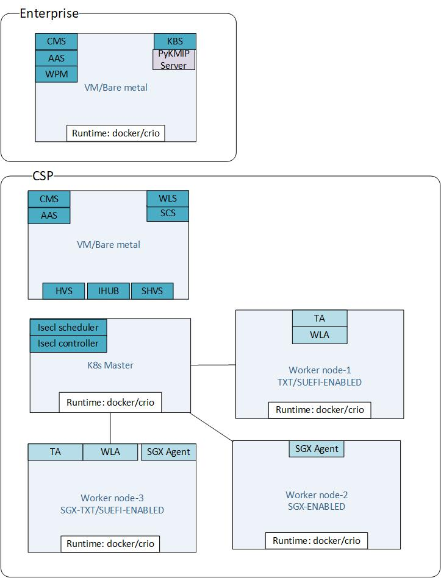
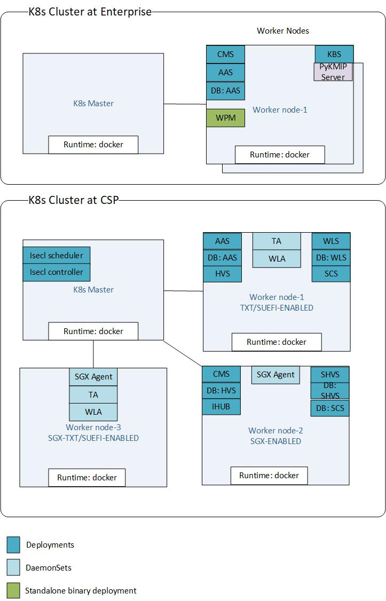

# Common Cluster Deployment Guide

Common Cluster deployment is for deploying both Foundational Security and Secure Key Caching components in a common Kubernetes cluster. The worker nodes may be separate with `TXT/BTG/SUEFI` enabled on a specific worker node and `SGX` on a separate worker node or all Intel Security hardware features enabled on a single worker node. 

This guide goes over the deployment steps to enable Common Cluster for Foundational Security and Secure Key Caching


<!-- @import "[TOC]" {cmd="toc" depthFrom=1 depthTo=6 orderedList=false} -->

<!-- code_chunk_output -->

- [Common Cluster Deployment Guide](#common-cluster-deployment-guide)
  - [Pre-requisites](#pre-requisites)
    - [Binary Deployment](#binary-deployment)
    - [Containerized Deployment](#containerized-deployment)
  - [Deployment Architecture](#deployment-architecture)
    - [Binary Deployment](#binary-deployment-1)
    - [Containerized Deployment](#containerized-deployment-1)
  - [Deployment Steps](#deployment-steps)
    - [Binary Deployment](#binary-deployment-2)
      - [Pre-requisites](#pre-requisites-1)
      - [Deployment](#deployment)
        - [Deploy isecl-controller](#deploy-isecl-controller)
        - [Deploy ihub](#deploy-ihub)
        - [Deploy isecl-scheduler](#deploy-isecl-scheduler)
        - [Configure kube-scheduler to establish communication with isecl-scheduler](#configure-kube-scheduler-to-establish-communication-with-isecl-scheduler)
    - [Containerized Deployment](#containerized-deployment-2)
      - [Pre-requisites](#pre-requisites-2)
      - [SKC Deployment](#skc-deployment)
      - [FS,WS Deployment](#fsws-deployment)
      - [Integration Hub and ISecL-K8s-Extensions Deployment](#integration-hub-and-isecl-k8s-extensions-deployment)
        - [ISecL-K8s-Extensions Custom-Controller](#isecl-k8s-extensions-custom-controller)
        - [Integration Hub](#integration-hub)
        - [ISecL-K8s-Extensions Extended-Scheduler](#isecl-k8s-extensions-extended-scheduler)
  - [Workload POD Launch Validation](#workload-pod-launch-validation)
    - [Launch Workload for SGX](#launch-workload-for-sgx)
    - [Launch Workload for FS](#launch-workload-for-fs)
  - [Appendix](#appendix)

<!-- /code_chunk_output -->

## Pre-requisites

### Binary Deployment

Binary deployment would enable all components of Foundational Security and Secure Key Caching to be deployed as binary systemd services in a VM and Host for Agent systemd services. Refer the following links for the pre-requisites and requirements

All Hardware, OS , Network, RPM's requirements are given the table below

| Use case                         | Details                                                      |
| -------------------------------- | ------------------------------------------------------------ |
| Foundational & Workload Security | [Quick Start Guide](https://github.com/intel-secl/docs/blob/master/quick-start-guides/Quick%20Start%20Guide%20-%20Intel%C2%AE%20Security%20Libraries%20-%20Foundational%20&%20Workload%20Security%20-%20Containerization.md#hardware--os-requirements) |
| Secure Key Caching               | [Quick Start Guide](https://github.com/intel-secl/docs/blob/master/quick-start-guides/Quick%20Start%20Guide%20-%20Intel%C2%AE%20Security%20Libraries%20-%20Secure%20Key%20Caching%20-%20Containerization.md#hardware--os-requirements) |

All Build steps and pre-requisites are given in the table below

| Use case                         | Details                                                      |
| -------------------------------- | ------------------------------------------------------------ |
| Foundational & Workload Security | [Quick Start Guide](https://github.com/intel-secl/docs/blob/master/quick-start-guides/Quick%20Start%20Guide%20-%20Intel%C2%AE%20Security%20Libraries%20-%20Foundational%20&%20Workload%20Security%20-%20Containerization.md#hardware--os-requirements) |
| Secure Key Caching               | [Quick Start Guide](https://github.com/intel-secl/docs/blob/master/quick-start-guides/Quick%20Start%20Guide%20-%20Intel%C2%AE%20Security%20Libraries%20-%20Secure%20Key%20Caching%20-%20Containerization.md#hardware--os-requirements) |

### Containerized Deployment

Containerized deployment would enable all components of Foundational Security and Secure Key Caching to be deployed as containers in a Kubernetes cluster. Refer the following links for the pre-requisites and requirements

All Hardware, OS , Network, RPM's requirements are given the table below

| Use case                         | Details                                                      |
| -------------------------------- | ------------------------------------------------------------ |
| Foundational & Workload Security | [Quick Start Guide](https://github.com/intel-secl/docs/blob/master/quick-start-guides/Quick%20Start%20Guide%20-%20Intel%C2%AE%20Security%20Libraries%20-%20Foundational%20&%20Workload%20Security%20-%20Containerization.md#hardware--os-requirements) |
| Secure Key Caching               | [Quick Start Guide](https://github.com/intel-secl/docs/blob/master/quick-start-guides/Quick%20Start%20Guide%20-%20Intel%C2%AE%20Security%20Libraries%20-%20Secure%20Key%20Caching%20-%20Containerization.md#hardware--os-requirements) |

All Build steps and pre-requisites are given in the table below

| Use case                         | Details                                                      |
| -------------------------------- | ------------------------------------------------------------ |
| Foundational & Workload Security | [Quick Start Guide](https://github.com/intel-secl/docs/blob/master/quick-start-guides/Quick%20Start%20Guide%20-%20Intel%C2%AE%20Security%20Libraries%20-%20Foundational%20&%20Workload%20Security%20-%20Containerization.md#hardware--os-requirements) |
| Secure Key Caching               | [Quick Start Guide](https://github.com/intel-secl/docs/blob/master/quick-start-guides/Quick%20Start%20Guide%20-%20Intel%C2%AE%20Security%20Libraries%20-%20Secure%20Key%20Caching%20-%20Containerization.md#hardware--os-requirements) |

## Deployment Architecture

### Binary Deployment



### Containerized Deployment




## Deployment Steps

### Binary Deployment

#### Pre-requisites

* Setup master and worker node for k8s. Worker node should be setup on SGX and SUEFI enabled host machine. Master node can be any system.

* To setup k8 cluster follow https://phoenixnap.com/kb/how-to-install-kubernetes-on-centos

* Follow "SGX Attestation Infrastructure and Secure Key Caching (SKC) Quick Start Guide" to build, setup and deploy all SKC services.

* Follow "Foundational & Workload Security Quick Start Guide" to build, setup and deploy all FS and WS services.

  > **Note**: Deployment of `isecl-controller`, `ihub` and `isecl-scheduler` will be manual.

- SKC services (CMS, AAS, SCS, SHVS) should be running on one VM, FS/WS services (CMS, AAS, HVS, WLS) should be running on other VM on CSP side.

- SGX-Agent, Trust-Agent and Workload-Agent should be running on worker node.

- Configure private registry

- Push images to private registry using skopeo command, (this can be done from build vm also)

  ```shell
  skopeo copy oci-archive:isecl-k8s-controller-<tag>-<commitid>.tar docker://<registryIP>:<registryPort>/isecl-k8s-controller:<tag>
  skopeo copy oci-archive:isecl-k8s-scheduler-<tag>-<commitid>.tar docker://<registryIP>:<registryPort>/isecl-k8s-scheduler:<tag>
  ```


#### Deployment


- `isecl-k8s-controller` and `isecl-k8s-scheduler` will deploy on Master Node and `ihub` will deploy on any CSP side VM

- Copy tar output `isecl-k8s-extensions-*.tar.gz` from build system's binaries folder to `/opt/` directory on the Master Node and extract the contents.

  ```shell
  cd /opt/
  tar -xvzf isecl-k8s-extensions-*.tar.gz
  cd isecl-k8s-extensions/
  ```

- Add the image names in `isecl-controller.yml` and `isecl-scheduler.yml` in `/opt/isecl-k8s-extensions/yamls` with full image name including registry IP/hostname (e.g :/isecl-k8s-scheduler:v3.6.1).


##### Deploy isecl-controller

- Create hostattributes.crd.isecl.intel.com crd

  ```
  kubectl apply -f yamls/crd-1.17.yaml
  ```

- Check whether the crd is created

  ```
  kubectl get crds
  ```

- Deploy isecl-controller

  ```
  kubectl apply -f yamls/isecl-controller.yaml
  ```

- Check whether the isecl-controller is up and running

  ```
  kubectl get deploy -n isecl
  ```

- Create clusterrolebinding for ihub to get access to cluster nodes

  ```
  kubectl create clusterrolebinding isecl-clusterrole --clusterrole=system:node --user=system:serviceaccount:isecl:isecl
  ```

- Fetch k8s token required for ihub installation and follow below IHUB installation steps,

  ```
  kubectl get secrets -n isecl
  kubectl describe secret default-token-<name> -n isecl
  ```


##### Deploy ihub

For iHub installation, make sure to update below configuration in `/root/ihub.env` before installing ihub on ihub VM.

- Copy /etc/kubernetes/pki/apiserver.crt from master node to /root on ihub systems. Update `KUBERNETES_CERT_FILE`.
- Get k8s token in master obtained by running `kubectl describe secret default-token-<name> -n isecl` command and update `KUBERNETES_TOKEN`
- Update `KUBERNETES_URL` with Master node IP and k8s port (default port 6443)


**When using 2 different instances of ihub on 2 different VMs:**

- Update the value of CRD name in /root/ihub.env

  ```
  KUBERNETES_CRD=custom-isecl-sgx (On SGX ihub)
  KUBERNETES_CRD=custom-isecl-hvs (On FS ihub)
  ```

- Update HVS and SHVS url in /root/ihub.env

  ```
  SHVS_BASE_URL=https://<SGX SHVS IP>:13000/sgx-hvs/v2 (On SGX ihub)
  HVS_BASE_URL=https://<FS HVS IP>:8443/sgx-hvs/v2 (On FS ihub)
  ```

- Deploy ihub for both SGX and FS

- After iHub deployment, copy /etc/ihub/ihub_public_key.pem from both ihub systems to /opt/isecl-k8s-extensions/ directory on k8 master system.

- Prefix sgx_ihub_public_key.pem for SGX ihub key and prefix hvs_ihub_public_key.pem for FS ihub key

  ```
  scp <user>@<SGX iHub host>:/etc/ihub/ihub_public_key.pem /opt/isecl-k8s-extensions/
  mv /opt/isecl-k8s-extensions/ihub_public_key.pem /opt/isecl-k8s-extensions/sgx_ihub_public_key.pem
  scp <user>@<FS iHub host>:/etc/ihub/ihub_public_key.pem /opt/isecl-k8s-extensions/
  mv /opt/isecl-k8s-extensions/ihub_public_key.pem /opt/isecl-k8s-extensions/hvs_ihub_public_key.pem
  ```


**When using 2 different instances of ihub on same VM:**

- Update the below values in /root/ihub.env and deploy ihub instance for SKC.

  ```
  KUBERNETES_CRD=custom-isecl-sgx
  SHVS_BASE_URL=https://<SGX SHVS IP>:13000/sgx-hvs/v2
  INSTANCE_NAME=ihub-sgx
  ```

- Update the below values in /root/ihub.env and deploy ihub instance for FS.

  ```
  KUBERNETES_CRD=custom-isecl-hvs
  HVS_BASE_URL=https://<FS HVS IP>:8443/sgx-hvs/v2
  INSTANCE_NAME=ihub-hvs
  ```

- After iHub deployment, copy both ihub public keys `/etc/ihub-sgx/ihub_public_key.pem` and `/etc/ihub-sgx/ihub_public_key.pem` from ihub system to /opt/isecl-k8s-extensions/ directory on k8 master system.

- Prefix sgx_ihub_public_key.pem for SGX ihub key and prefix hvs_ihub_public_key.pem for FS ihub key

  ```
  scp <user>@<SGX iHub host>:/etc/ihub-sgx/ihub_public_key.pem /opt/isecl-k8s-extensions/
  mv /opt/isecl-k8s-extensions/ihub_public_key.pem /opt/isecl-k8s-extensions/sgx_ihub_public_key.pem
  scp <user>@<FS iHub host>:/etc/ihub-hvs/ihub_public_key.pem /opt/isecl-k8s-extensions/
  mv /opt/isecl-k8s-extensions/ihub_public_key.pem /opt/isecl-k8s-extensions/hvs_ihub_public_key.pem
  ```


**When using common instance of ihub on same VM:**

- Update the below values in /root/ihub.env and deploy common ihub instance.

  ```
  KUBERNETES_CRD=custom-isecl
  SHVS_BASE_URL=https://<SGX SHVS IP>:13000/sgx-hvs/v2
  HVS_BASE_URL=https://<FS HVS IP>:8443/sgx-hvs/v2
  INSTANCE_NAME=ihub
  ```

- After iHub deployment, copy ihub public keys `/etc/ihub/ihub_public_key.pem`  from ihub system to /opt/isecl-k8s-extensions/ directory on k8 master system.

- Create 2 copy of same ihub public key with prefix sgx_ihub_public_key.pem for SGX and hvs_ihub_public_key.pem for FS.

  ```
  scp <user>@<iHub host>:/etc/ihub/ihub_public_key.pem /opt/isecl-k8s-extensions/
  cp /opt/isecl-k8s-extensions/ihub_public_key.pem /opt/isecl-k8s-extensions/sgx_ihub_public_key.pem
  mv /opt/isecl-k8s-extensions/ihub_public_key.pem /opt/isecl-k8s-extensions/hvs_ihub_public_key.pem
  ```


##### Deploy isecl-scheduler

- The isecl-scheduler default configuration is provided for common cluster support in /opt/isecl-k8s-extensions/yamls/isecl-scheduler.yaml. Variables HVS_IHUB_PUBLIC_KEY_PATH and SGX_IHUB_PUBLIC_KEY_PATH are by default set to default paths.

- Install cfssl and cfssljson on Kubernetes Control Plane

  ```
  wget -O /usr/local/bin/cfssl http://pkg.cfssl.org/R1.2/cfssl_linux-amd64
  chmod +x /usr/local/bin/cfssl
  wget -O /usr/local/bin/cfssljson http://pkg.cfssl.org/R1.2/cfssljson_linux-amd64
  chmod +x /usr/local/bin/cfssljson
  ```

- Create TLS key pair for isecl-scheduler service, which is signed by k8s apiserver.crt

  ```
  cd /opt/isecl-k8s-extensions/
  chmod +x create_k8s_extsched_cert.sh
  ./create_k8s_extsched_cert.sh -n "K8S Extended Scheduler" -s "<K8_MASTER_IP>","<K8_MASTER_HOST>" -c /etc/kubernetes/pki/ca.crt -k /etc/kubernetes/pki/ca.key
  ```

- Copy TLS key pair generated in previous step to secrets directory.

  ```
  mkdir secrets
  cp /opt/isecl-k8s-extensions/server.key secrets/
  cp /opt/isecl-k8s-extensions/server.crt secrets/
  mv /opt/isecl-k8s-extensions/sgx_ihub_public_key.pem secrets/
  mv /opt/isecl-k8s-extensions/hvs_ihub_public_key.pem secrets/
  ```

- Create kubernetes secrets scheduler-secret for isecl-scheduler

  ```
  kubectl create secret generic scheduler-certs --namespace isecl --from-file=secrets
  ```

- Deploy isecl-scheduler

  ```
  kubectl apply -f yamls/isecl-scheduler.yaml
  ```

- Check whether the isecl-scheduler is up and running

  ```
  kubectl get deploy -n isecl
  ```


##### Configure kube-scheduler to establish communication with isecl-scheduler

- Add scheduler-policy.json under kube-scheduler section, mountPath under container section and hostPath under volumes section in /etc/kubernetes/manifests/kube-scheduler.yaml as mentioned below

```
spec:
  containers:
  - command:
    - kube-scheduler
    - --policy-config-file=/opt/isecl-k8s-extensions/scheduler-policy.json
  
  containers:
    volumeMounts:
    - mountPath: /opt/isecl-k8s-extensions/
      name: extendedsched
      readOnly: true
  
  volumes:
  - hostPath:
      path: /opt/isecl-k8s-extensions/
      type:
    name: extendedsched
```

>  Note: Make sure to use proper indentation and don't delete existing mountPath and hostPath sections in kube-scheduler.yaml.

- Restart Kubelet which restart all the k8s services including kube base schedular

  ```
  systemctl restart kubelet
  ```

- Check if CRD data is populated

  ```
  kubectl get -o json hostattributes.crd.isecl.intel.com
  kubectl get nodes --show-labels
  ```


### Containerized Deployment

#### Pre-requisites

* SGX and SUEFI both HW features should be enabled on Worker node.

* The K8s cluster admin configure the existing bare metal worker nodes or register fresh bare metal worker nodes with labels. For example, a label like `node.type: SGX-SUEFI-ENABLED` can be used by the cluster admin to distinguish the baremetal worker node and the same label can be used in ISECL Agent pod configuration to schedule on all worker nodes marked with the label.

  ```shell
  #Label node , below example is for SGX & SUEFI enabled host
  kubectl label node <node-name> node.type=SGX-SUEFI-ENABLED
  
  #Label node , below example is for SGX & TXT enabled host
  kubectl label node <node-name> node.type=SGX-TXT-ENABLED
  ```

* Based on the worker node as given the deployment architecture diagram, the respective agent `daemonsets` should be updated with the node-affinity as per the labels put on the worker nodes

* User needs to create on NFS volumes manually or using custom scripts for both use cases inside same directory `/<NFS-vol-base-path>/isecl/`

  > **Note**: Deployment of `isecl-controller`, `ihub` and `isecl-scheduler` will be manual.

#### SKC Deployment

* Ensure to have all the container images pushed to the registry of choice.

* Install pre-reqs using `platform-dependencies` on respective SGX enabled nodes

* Copy `manifests` to K8s-Controller node to `/root/skc`

* Update `isecl-skc-k8s.env`

* Run the following steps  for deployment

  ```shell
  # Run pre-requisites
  ./pre-requisites.sh
  
  # Bootstrap DB pods
  ./isecl-bootstrap-db-services.sh up
  
  # Deploy SKC Services and Agents
  ./isecl-bootstrap.sh up secure-key-caching
  ```

#### FS,WS Deployment

* Ensure to have all the container images pushed to the registry of choice.

* Install pre-reqs using `platform-dependencies` on respective TXT/SUEFI enabled nodes for Foundational Security use case

* Install pre-reqs for `container-runtime` on respective nodes as applicable for Workload Security use case

* Copy `manifests` to K8s-Controller node to `/root/fs`

* Update `isecl-k8s.env` with relevant data as applicable

* Run the following steps  for deployment

  ```shell
  # Run pre-requisites
  ./pre-requisites.sh
  
  # Bootstrap DB pods
  ./isecl-bootstrap-db-services.sh up
  
  # Deploy Foundational Security Services and Agents
  ./isecl-bootstrap.sh up foundation-security
  ```

#### Integration Hub and ISecL-K8s-Extensions Deployment

##### ISecL-K8s-Extensions Custom-Controller 

* Run the following to deploy `isecl-controller` from `manifests` folder under `/root/fs`

  ```shell
  ./isecl-bootstrap.sh up isecl-controller
  
  ```

##### Integration Hub

* Run the following to deploy `ihub` from `manifests` folder under `/root/fs` pointing to `HVS` only

  ```shell
  ./isecl-bootstrap.sh up ihub
  ```

* Run the following for pointing IHUB to both `HVS` and `SHVS`:

  * Open `configMap.yml` under `/root/fs/manifests/ihub/configMap.yml`
  * Add setup task `SHVS_BASE_URL: https://shvs-svc.isecl.svc.cluster.local:13000/sgx-hvs/v2` in the same configMap inside data section
  * Add `SETUP_TASK: "attestation-service-connection"` inside data section
  * Provide unique name to new configMap inside metadata section
  * Provide the same name in the `deployment.yml` under `configMapRef` section
  * Deploy the `ihub` service again with  ` kubectl kustomize . | kubectl  apply -f -`

##### ISecL-K8s-Extensions Extended-Scheduler

* Run the following to deploy `isecl-scheduler` from `manifests` folder under `/root/fs`

  * Copy ihub public key from NFS to K8s Controller and update `isecl-k8s.env` for `IHUB_PUB_KEY_PATH`

  * Run below commands:

    ```shell
    # Set environment variables
    export K8S_MASTER_IP=<k8s Master IP>
    export K8S_MASTER_HOSTNAME=<k8s Master Hostname>
    export K8S_CA_KEY=/etc/kubernetes/pki/ca.key
    export K8S_CA_CERT=/etc/kubernetes/pki/ca.crt
    
    # Create Extended Scheduler Certs
    cd k8s/manifests/k8s-extensions-scheduler/ 
    chmod +x scripts/create_k8s_extsched_certs.sh
    cd scripts && echo ./create_k8s_extsched_certs.sh -n "K8S Extended Scheduler" -s "$K8S_MASTER_IP","$K8S_MASTER_HOSTNAME" -c "$K8S_CA_CERT" -k "$K8S_CA_KEY"
    ./create_k8s_extsched_certs.sh -n "K8S Extended Scheduler" -s "$K8S_MASTER_IP","$K8S_MASTER_HOSTNAME" -c "$K8S_CA_CERT" -k "$K8S_CA_KEY"
    
    # Created Extended Scheduler secrets
    cd ..
    mkdir -p secrets
    cp scripts/server.key secrets/
    cp scripts/server.crt secrets/
    cp /<IHUB_PUB_KEY_PATH>/ihub_public_key.pem secrets/hvs_ihub_public_key.pem
    cp /<IHUB_PUB_KEY_PATH>/ihub_public_key.pem secrets/sgx_ihub_public_key.pem
    ```

  * Update `SGX_IHUB_PUBLIC_KEY_PATH` and `HVS_IHUB_PUBLIC_KEY_PATH` inside `k8s/manifests/k8s-extensions-scheduler/isecl-scheduler.yml` as mentioned below:

    ```yaml
    - name: SGX_IHUB_PUBLIC_KEY_PATH
      value: /opt/isecl-k8s-extensions/sgx_ihub_public_key.pem
    - name: HVS_IHUB_PUBLIC_KEY_PATH
      value: /opt/isecl-k8s-extensions/hvs_ihub_public_key.pem
    ```

  * Create Secret

    ```shell
    kubectl create secret generic scheduler-certs --namespace isecl --from-file=secrets
    ```

  * Deploy `isecl-scheduler`

    ```shell
    kubectl kustomize . | kubectl  apply -f -
    ```

  * Create and update `scheduler-policy.json` path

    ```shell
    mkdir -p /opt/isecl-k8s-extensions
    cp manifests/k8s-extensions-scheduler/config/scheduler-policy.json /opt/isecl-k8s-extensions
    ```

  * Configure kube-scheduler to establish communication with isecl-scheduler. Add `scheduler-policy.json` under kube-scheduler section, `mountPath` under container section and `hostPath` under volumes section in ` /etc/kubernetes/manifests/kube-scheduler.yaml` as mentioned below

    ```yaml
    spec:
      containers:
      - command:
        - kube-scheduler
        - --policy-config-file=/opt/isecl-k8s-extensions/scheduler-policy.json
    containers:
        volumeMounts:
        - mountPath: /opt/isecl-k8s-extensions/
          name: extendedsched
          readOnly: true
    volumes:
      - hostPath:
          path: /opt/isecl-k8s-extensions/
          type:
        name: extendedsched
    ```

    > **Note:** Make sure to use proper indentation and don't delete existing `mountPath` and `hostPath` sections in `kube-scheduler.yaml`

  * Restart `kubelet` which restart all the k8s services including kube-scheduler

    ```shell
    systemctl restart kubelet
    ```

    

## Workload POD Launch Validation

### Launch Workload for SGX

- Create below sample sgx_pod.yml file for nginx workload and add SGX labels as node affinity to it.

```yaml
apiVersion: v1
kind: Pod
metadata:
  name: nginx-sgx
  labels:
    name: nginx-sgx
spec:
  affinity:
    nodeAffinity:
     requiredDuringSchedulingIgnoredDuringExecution:
       nodeSelectorTerms:
       - matchExpressions:
         - key: SGX-Enabled
           operator: In
           values:
           - "true"
         - key: EPC-Memory
           operator: In
           values:
           - "2.0GB"
  containers:
  - name: nginx
    image: nginx
    ports:
    - containerPort: 80
```

- Launch the pod by running below command:

```shell
kubectl apply -f sgx_pod.yml
```

* Check pod status using

```shell
kubectl get pod -l name=nginx-sgx
```


### Launch Workload for FS

- Create below sample `fs_pod.yml` file for nginx workload and add trusted labels as node affinity to it.

```yaml
apiVersion: v1
kind: Pod
metadata:
  name: nginx-fs
  labels:
    name: nginx-fs
spec:
  affinity:
    nodeAffinity:
     requiredDuringSchedulingIgnoredDuringExecution:
       nodeSelectorTerms:
       - matchExpressions:
         - key: isecl.trusted
           operator: In
           values:
           - "true"
  containers:
  - name: nginx
    image: nginx
    ports:
    - containerPort: 80
```

- Launch the pod by running below command:

```shell
kubectl apply -f fs_pod.yml
```

* Check pod status using

```shell
kubectl get pod -l name=nginx-fs
```

## Appendix

**Important Note:** SGX Attestation fails when SGX is enabled on a host booted using tboot

**Root Cause:** tboot requires the "noefi" kernel parameter to be passed during boot, in order to not use an unmeasured EFI runtime services. As a result, the kernel does not expose EFI variables to user-space. SGX Attestation requires these EFI variables to fetch Platform Manifest data. 

**Workaround:**

The EFI variables required by SGX are only needed during the SGX provisioning/registration phase. Once this step is completed successfully, access to the EFI variables is no longer required. This means this issue can be worked around by installing the SGX agent without booting to tboot, then rebooting the system to tboot. SGX attestation will then work as expected while booted to tboot.

1. Enable SGX and TXT in the platform BIOS

2. Perform SGX Factory Reset and boot into the “plain” distribution kernel (without tboot or TCB)

3. Install tboot and ISecL components (SGX Agent, Trust Agent and Workload Agent)

4. The SGX Agent installation fetches the SGX Platform Manifest data and caches it

5. Reboot the system into the tboot kernel mode.

6. Verify that TXT measured launch was successful:

   `txt-stat |grep "TXT measured launch"`

7. The SGX and Platform Integrity Attestation use cases should now work as normal.
